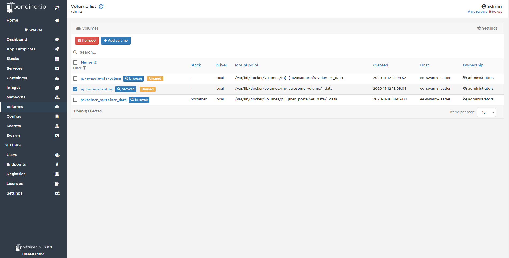

# Delete a Volume

From Portainer you can delete a volume. Note that all the content inside the deleted volume will be erased.

## Deleting a Volume

Go to <b>Volumes</b>, select the volume you want remove, and click <b>Remove</b>. 

<b>Note:</b> You can't delete volumes attached to a container, to do this, remove the container first and then, try to delete the volume.

## :material-note-text: Notes

[Contribute to these docs](https://github.com/portainer/portainer-docs/blob/master/contributing.md){target=_blank}