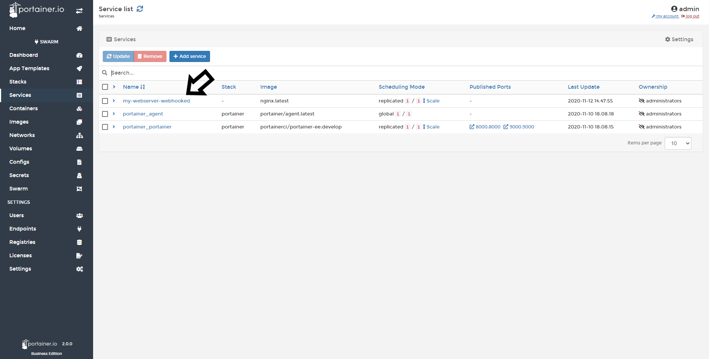
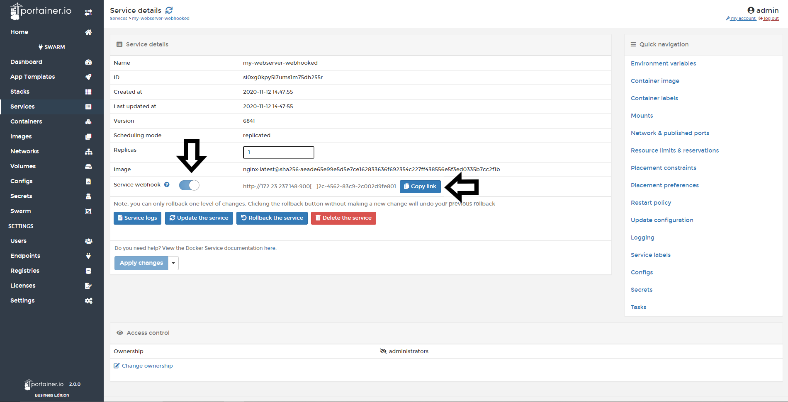

# Webhooks

You can use webhooks to cause an action in a service in response to a push event in a repository. Webhooks are POST requests sent to a URL you define in Docker Hub or another registry.

## Enable Service Webhook

To enable a webhook for a service, go to <b>Services</b>, click in the service you want to set up the Webhook, and enable the toggle <b>Service Webhook</b>.



After you enable the toggle you will see the URL to configure your webhook in Docker Hub or another repository. do a click in <b>copy</b> to get the full URL.



## Examples

Here, you can find a few examples to understand how easy is to trigger the webhook.

### Redeploy

```
<form action="http://192.168.1.12:9000/api/webhooks/638e6967-ef77-4906-8af8-236800621360" method="post">
  Redeploy with latest image of same tag <input type="submit" />
</form>
```

### Update Service with another tag

```
<form action="http://192.168.1.12:9000/api/webhooks/638e6967-ef77-4906-8af8-236800621360?tag=latest" method="post">
  Update Service image with different tag <input type="submit" />
</form>
```

## Configuring the Webhook in Docker Hub

To see how to complete the configuration in Docker Hub, [click here](https://docs.docker.com/docker-hub/webhooks/).

## Notes

[Contribute to these docs](https://github.com/portainer/portainer-docs/blob/master/contributing.md).