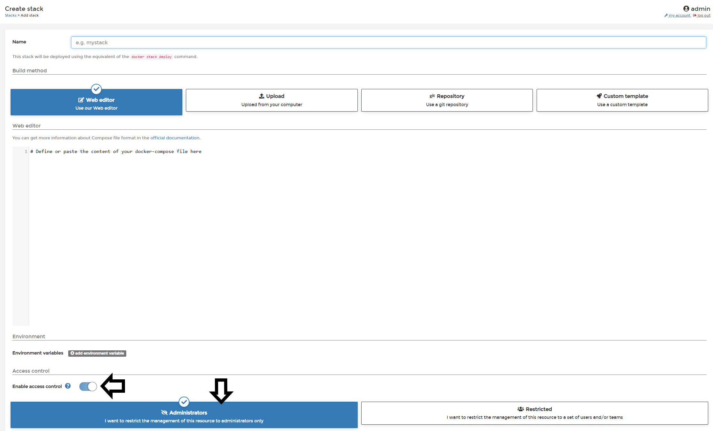
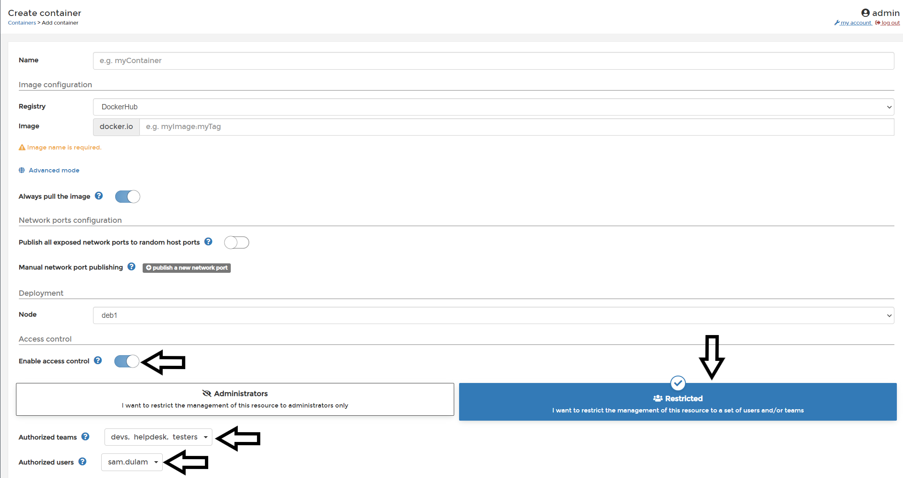

# :fontawesome-solid-users-cog: Access Control

All docker or docker swarm resources created through Portainer except images have Access Control settings. You can set these at the time of creation or later on as needed. Any resources created through a stack or service will inherit the same access as the parent. Below are examples of different sets of Access Controls you can have.

### Administrators Only

The is an example Create Stack screen, deploys a stack with Access Control Enabled and only Portainer Administrators will have access to the Stack and any Resources created through the stack (eg. Containers/Services/Volumes/Networks/Secrets etc)

### Public

This is an example Create Service Screen, deploys a service with Access Control disabled. All Portainer Users will have access to the service and any resources created through the service (eg. Containers/Volumes/Networks/Secrets etc)

### Restricted to Specific Groups/Users

This is an example Create Container Screen, deploys a Container with Access Control Enabled. Once you select the Restricted option, you may select 'one or more teams' and or 'one or more users' to have access to the Resource.

## :material-note-text: Notes

[Contribute to these docs](https://github.com/portainer/portainer-docs/blob/master/contributing.md){target=\_blank}

