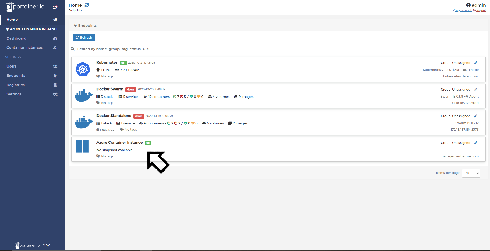
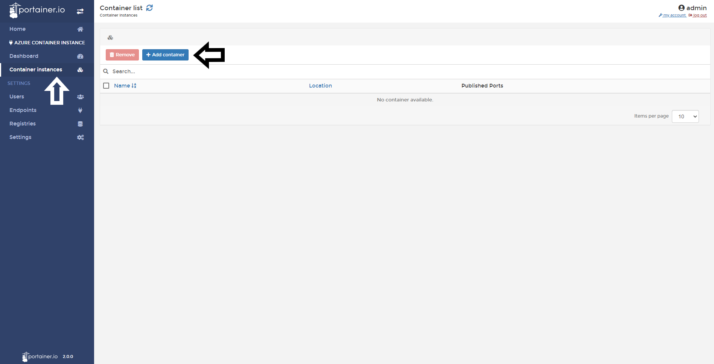
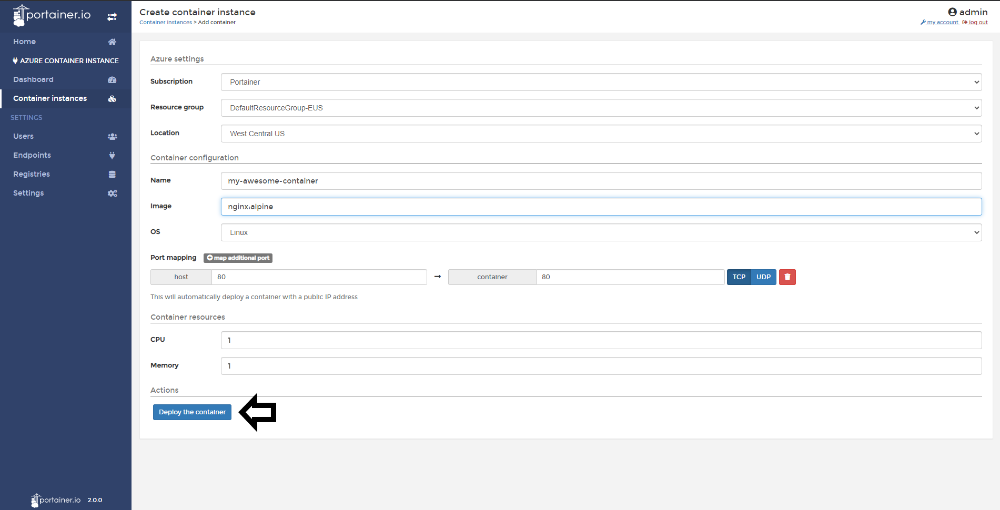
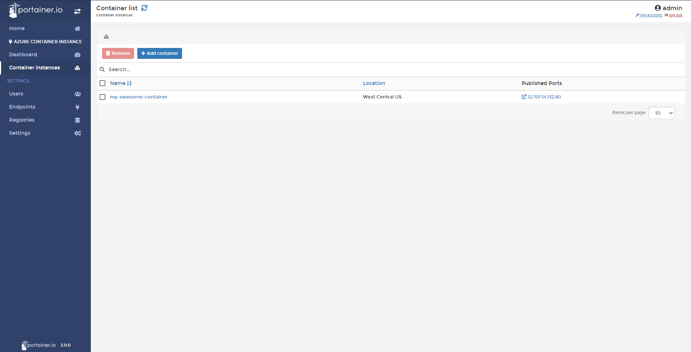

# Add a Container Instance

From Portainer you'll able to add new containers in your Azures Container Instance service. Take a look at the next section to learn how to do it.

## Adding a New Container Instance

From Portainer's Home, click in your Azure Container Instance endpoint. 

Click in Container Instances and then in <b>Add Container</b>.

In the next screen, you need to define the container configuration, let's see what options you have available:

* Subscription: If you have two or more subscription attached, you can choose where you want to deploy your container.
* Resource Group: If you have two or more Resources groups created, you need to define where you want to deploy your container.
* Location: Here you need to define in wich datacenter you want to run your container.
* Name: Name your container.
* Image: Type the name of the image you want to deploy.
* OS: If is a Linux based container, choose Linux, if for example is a Windows Server container, choose Windows.
* Port Mapping: Choose what port you need to publish to the Internet.
* CPU: Define how much CPU you want for your container.
* Memory: Define how much memory you want for your container.

When everything is set, do a click in <b>Deploy the Container</b>.

Meanwhile the deployment is going, you will see this message in the button. 

After the deployment was complete, Portainer will exit to the container list and you will see your new container deployed in Azure Container Instances.

## Notes

[Contribute to these docs](https://github.com/portainer/portainer-docs/blob/master/contributing.md).
