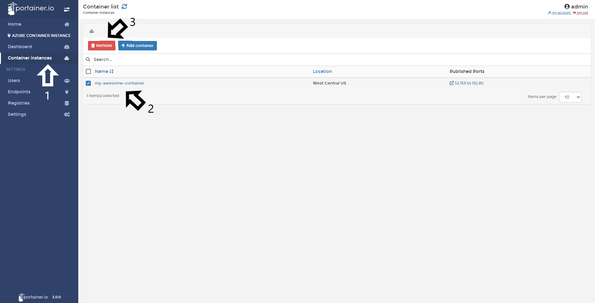

# Delete a Container

From Portainer, you will able to delete your containers running in Azure containers instances.

## Deleting containers

To delete containers, do a click in <b>Container Instances</b>, select the container you want to delete and do a click in <b>Remove</b>.

After remove the container, you will see a pop up confirming that action. 

## Notes

[Contribute to these docs](https://github.com/portainer/portainer-docs/blob/master/contributing.md).