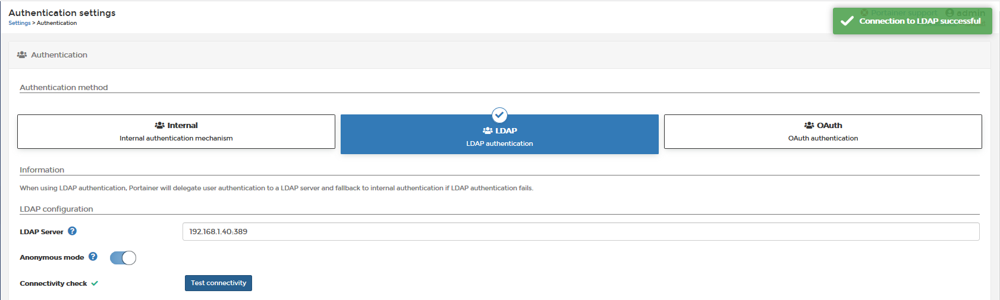
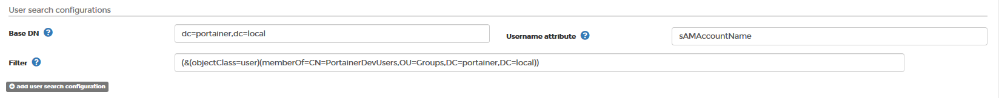

# LDAP/AD Authentication

Portainer can be configured to accept Lightweight Directory Access Protocol (LDAP) authentication if your organization has implemented LDAP or Active Directory authentication. When users attempt to log into Portainer, the application will authenticate them against your LDAP directory or Active Directory. If authentication is successful, the user is allowed to log into Portainer.

In order to configure Portainer LDAP authentication, you first need to add a user to your directory service for the purpose of authenticating from Portainer to read the LDAP. The user should be a service account that needs read-only access to LDAP/Active Directory.

## Enabling LDAP

Log into Portainer as an administrator and navigate to Settings > Authentication. Select the ‘LDAP Authentication' option. Portainer will then display additional fields for configuring LDAP.

Enter in the IP address/FQDN and the port number of your LDAP server, and then select to either connect anonymously (your LDAP server must support this), or enter a user account that has READ access to the directory. Click "Test Connectivity" to validate you can connect.

Note: For AD use the Reader DN format should be <code>username@MYDOMAIN.com</code> or <code>domain\userfirstname.userlastname</code>. For OpenLDAP, the Reader DN format should be <code>CN=<USERNAME>,DC=DOMAIN,DC=DOMAIN</code>.

You can now configure the remaining LDAP settings:

## Explanation of Settings

Here is an explanation of the above settings:

### LDAP Security

* Use StartTLS: After the initial connection, elevate the insecure connection to secure.
* Use TLS: Initiate a connection to LDAP using TLS.
* Skip Verification of Certificate: If you do not have access to the certificate of the LDAP server, skipping verification enables encrypted communications, but you must manually ensure that you are talking to the intended LDAP server that you gave in your URL. If that gets maliciously redirected then you could be talking to a different server. Use with caution.
* TLS CA Certificate: Upload your CA Certificate for the secure connection.
* Connectivity Check:Validate successful connectivity before continuing.

### Automatic User Provisioning

* Automatic User Provisioning: Enabling this setting automatically creates users within Portainer once they are successfully authenticated by LDAP. If you do not enable this, you must manually create users with the same username as the corresponding LDAP directory.

### User Search Configurations

* Base DN: Enter <code>DC=MYDOMAIN,DC=com</code> to search your entire Directory for the username attempting to login. or <code>OU=<MYOU>,DC=<MYDOMAIN>,DC=<COM></code> to search for users only within the specified OU, or <code>CN=NAME,DC=<MYDOMAIN>,DC=<COM></code> if your users are only in a container (in AD, the default is that all users are in a container called users; CN=Users). If you have a large number of users in your Domain, you should narrow the scope Portainer searches by using OU's.

* Username Attribute: For Native LDAP, Enter <code>uid</code>; For Active Directory, either enter <code>userPrincipalName</code> if your usernames will be in the format of <code>user@mydomain.com</code> enter <code>SAMAccountName</code> if your usernames will be in the format <code>username</code>. Do not use uid with Active Directory as it will not work.

Note: These entries are case sensitive.

* Filter: Enter a criteria to pre-filter the results returned from LDAP to Portainer.

Example, to only allow users who are members of a group, which is a group defined within an OU to login, set the Filter to be: (the brackets are important, so copy the entire string below)..

<pre><code>(&(objectClass=user)(memberOf=CN=<GROUPNAME>,OU=<MYOU>,DC=<DOMAIN>,DC=<DOMAIN>))</code></pre>

The example below shows that in the domain portainer.local, we have an OU called "Groups" and within that OU is a group called "PortainerDevUsers". This search filter will only allow users to login to Portainer that are members of the PortainerDevUsers LDAP group.

### Group Search

Portainer optionally allows you to set a Group Search as well as the User Search. If this is configured, if an LDAP user is a member of an LDAP group, and that LDAP Group corresponds to an identically named Portainer TEAM, then the LDAP user will automatically be placed into the Portainer Team based on their LDAP group membership. This is very useful for automatically granting access to Portainer endpoints via group membership.

* Group Base DN: Enter <code>DC=<MYDOMAIN>,DC=<COM></code> to search your entire Directory for the list of groups. or <code>OU=<MYOU>,DC=<MYDOMAIN>,DC=<COM></code> to search for groups only within the specified OU, or <code>CN=NAME,DC=<MYDOMAIN>,DC=<COM></code> if your groups are only in a container (in AD, the default is that all groups are in a container called users; CN=Users). If you have a large number of groups in your Domain, you should narrow the scope Portainer searches by using OU's.

* Group Membership Attribute: Enter "member" as the attribute that determines if a user is a member of a group.

* Group Filter: If you want to filter the list of groups returned, to say, only return groups that contain the string "Portainer" (eg PortainerDev, PortainerProd, PortainerUAT", you can set the filter as follows:

<pre><code>(&(objectclass=group)(cn=*Portainer*))</code></pre>

### Optional - if you are NOT enabling user Auto Provisioning - Creating LDAP Users

Navigate to User Management. Create a username that matches your LDAP source users with the format defined when enabling LDAP (either ‘username’ or ‘username@mydomain.com’).

## Notes

[Contribute to these docs](https://github.com/portainer/portainer-docs/blob/master/contributing.md).