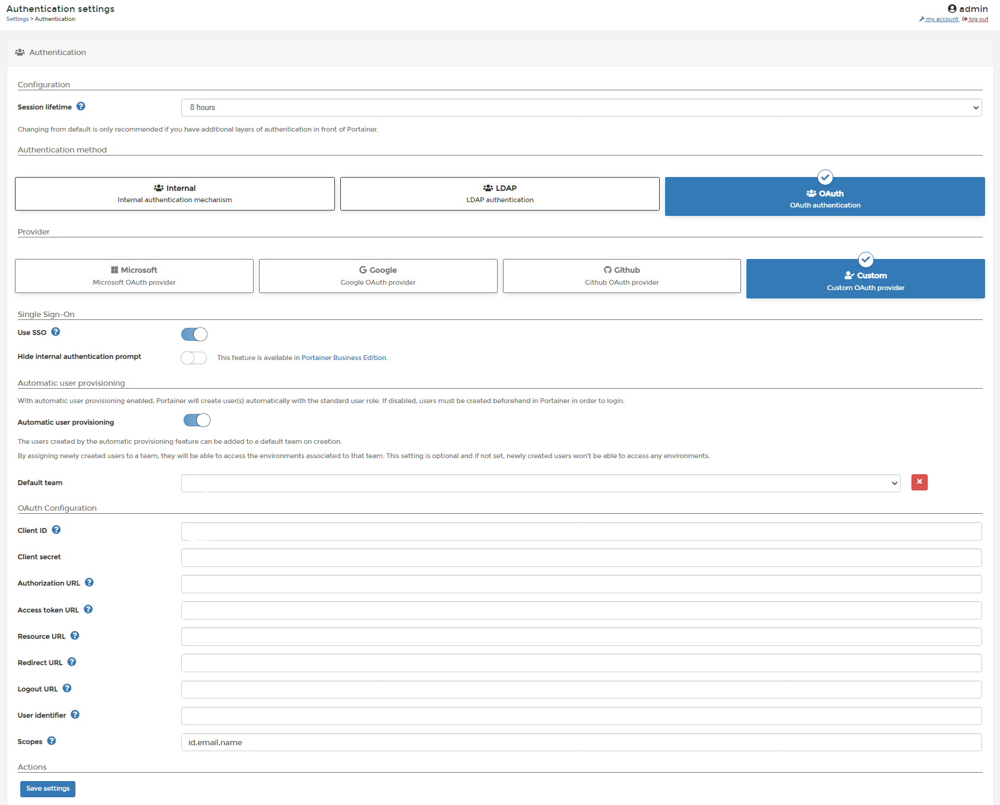
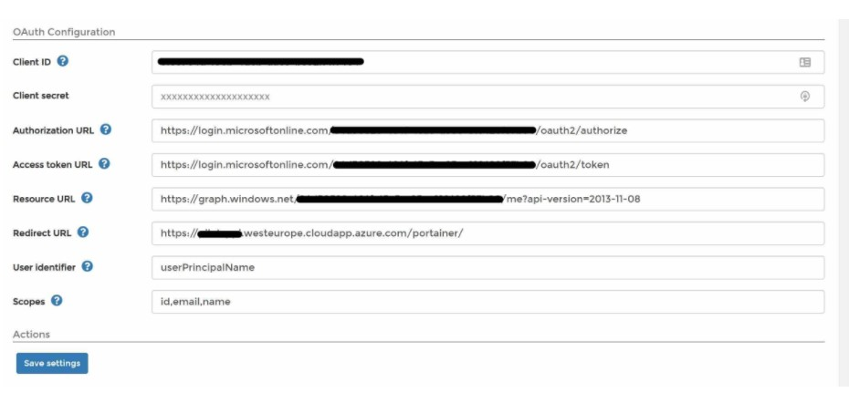
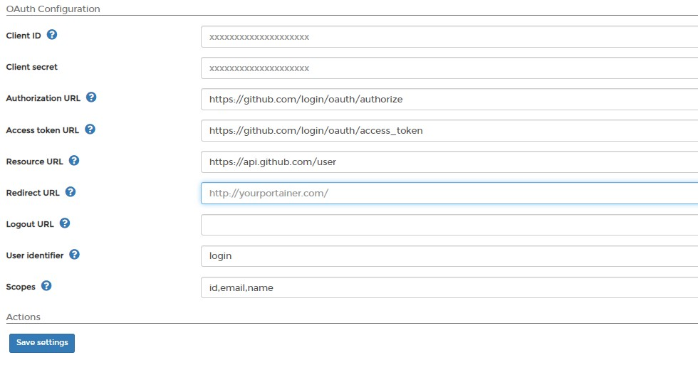
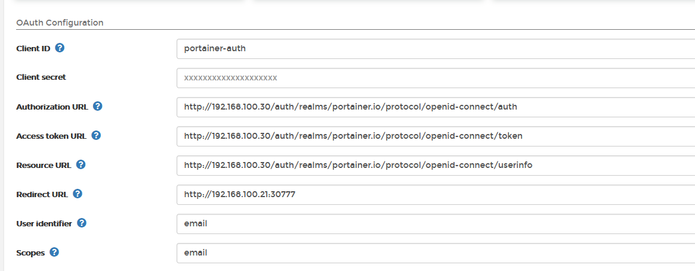

# OAuth authentication

Portainer allows that the authentication can be done with OAuth and with this help article, you will see a overview of what's the requirement to configure Portainer CE 2.0 with OAuth. 

## Start to configure OAuth authentication in Portainer

Once you logged to Portainer, click in <b>Settings</b> and then in <b>authentication</b>. After that, select <b>OAuth</b> option.

In this screen, you need to configure the data that you OAuth provider give you to configure Portainer. The fields are:

* Automatic User Provisioning: Toggle on the                       se options if you want to create users for each user logged using OAuth. After enable the toggle, you need to define in wich team that users should be created. 

* Client ID: This is the public identifier of the OAuth application.
* Client Secret: Here, you need to fill with the token access to the OAuth Application.
* Authorization URL: URL used to authenticate against the OAuth provider. Will redirect the user to the OAuth provider login view.
* Access Token URL: URL used to authenticate against the OAuth provider. Will redirect the user to the OAuth provider login view.
* Resource URL: URL used by Portainer to retrieve information about the authenticated user.
* Redirect URL: URL used by the OAuth provider to redirect the user after successful authentication. Should be set to your Portainer instance URL.
* User Identifier: Identifier that will be used by Portainer to create an account for the authenticated user. Retrieved from the resource server specified via the Resource URL field.
* Scopes: Required by the OAuth provider to retrieve information about the authenticated user. Refer to your OAuth provider documentation for more information about this.

Once that all fields are completed, do a click in <b>Save Settings</b>

## Manage access to OAuth Team and Users

To understand how to enable access to OAuth Teams and Users, please, refer to [this article](/v2.0/endpoints/access).

## Examples

Take a look at the following examples for configuration OAuth using Azure, Google and Github configuration.

* The client ID, called application ID in the MSFT world.
* The tenant ID (grayed information in the screenshot), is a GUID specific for your ID.
* This is just a custom-defined name for the URL of Portainer.

### Azure

### Google

### Github

### Keycloak

# Notes

[Contribute to these docs](https://github.com/portainer/portainer-docs/blob/master/contributing.md){target=_blank}