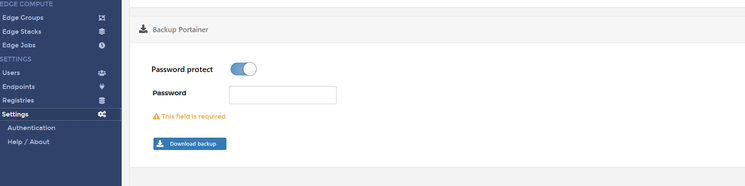

# :material-backup-restore: Backup Portainer

!!! Note "**Backup and Restore** feature is introduced in Portainer CE Version 2.5" 

Backup includes all information that Portainer stores on the /data volume, archived in a tar.gz file and optionally encrypted with a provided password. This archive is all you need to restore Portainer.

Logged in as an Admin, you will find the Backup option under Settings menu in Portainer. 

## :material-harddisk: Backup to Local Disk

!!! Abstract ""
    

    Login as an Admin User into Portainer

    Click on Settings in the menu

    Scroll down to Backup Portainer Option

    **Download backup file** is the default option, you can toggle the Password protect on and enter a password to encrypt the backup file

    Click on **Download backup**

    *A tar.gz file will be downloaded through your browser.*

## :material-note-text: Notes

[Contribute to these docs](https://github.com/portainer/portainer-docs/blob/master/contributing.md){target=\_blank}