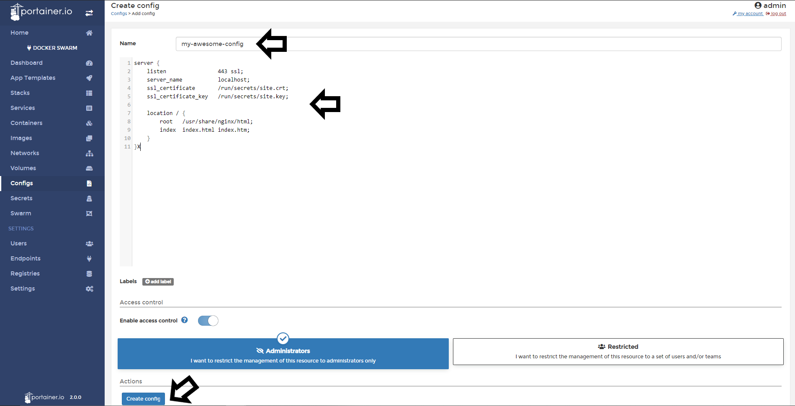

# Add configs

Docker 17.06 introduces swarm service configs, which allow you to store non-sensitive information, such as configuration files, outside a service’s image or running containers. This allows you to keep your images as generic as possible, without the need to bind-mount configuration files into the containers or use environment variables.

## Adding Configs

To add configs to Portainer click <b>Configs</b> and then <b>Add config</b>.

Then, in the Editor, you need to write your configuration. In this example, you can see an nginx configuration file. 

Once this config is defined, you can add labels and/or manage access control of this config. 

When everything is set, click <b>Create config</b>.

## Notes

[Contribute to these docs](https://github.com/portainer/portainer-docs/blob/master/contributing.md).