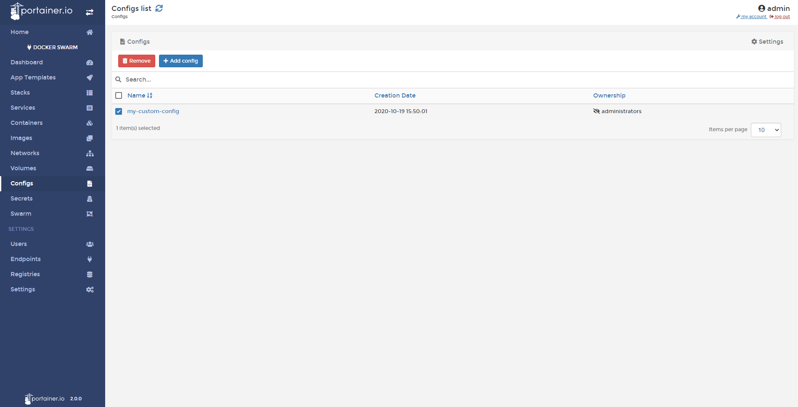

# Delete Configs

From Portainer you can delete the configs that you created before. 

## Deleting Configs

To delete a config, go to <b>Configs</b>, select the config you want to delete and click <b>Remove</b>.

## :material-note-text: Notes

[Contribute to these docs](https://github.com/portainer/portainer-docs/blob/master/contributing.md){target=_blank}