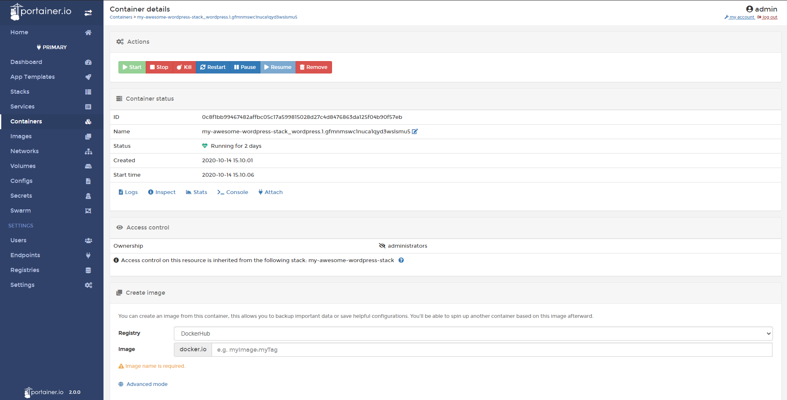
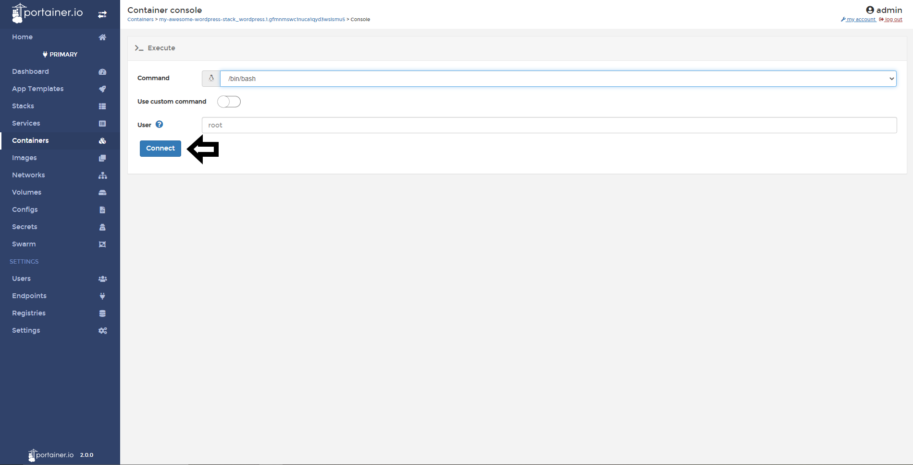
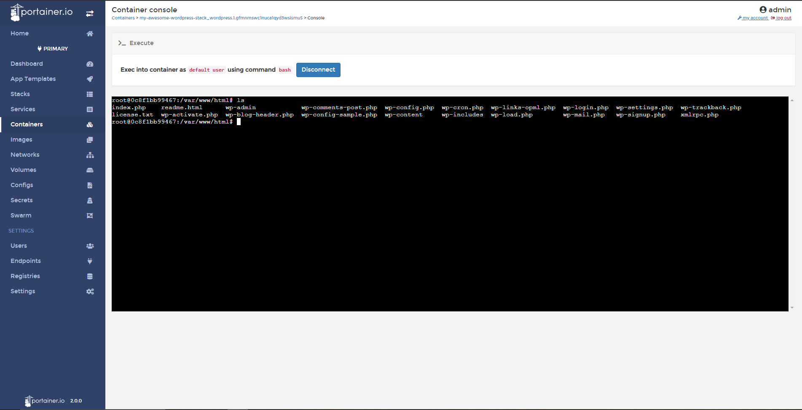

# Access to a Container console

From Portainer you will able to access to the console of your containers. This is very useful when you need to tweak your containers.

## Accesing to container console

To access to a specific container console, go to <b>Containers</b> and select the container you want.

After that, do a click in <b>Console</b>.

Select your command and the user you want to use to access to the console. If you're using an Alpine Linux container, you need to change your command from the list and pick /bin/ash.

If everything work as expected, you will see the console and you can run commands like any other Linux system. 

## Notes

[Contribute to these docs](https://github.com/portainer/portainer-docs/blob/master/contributing.md).