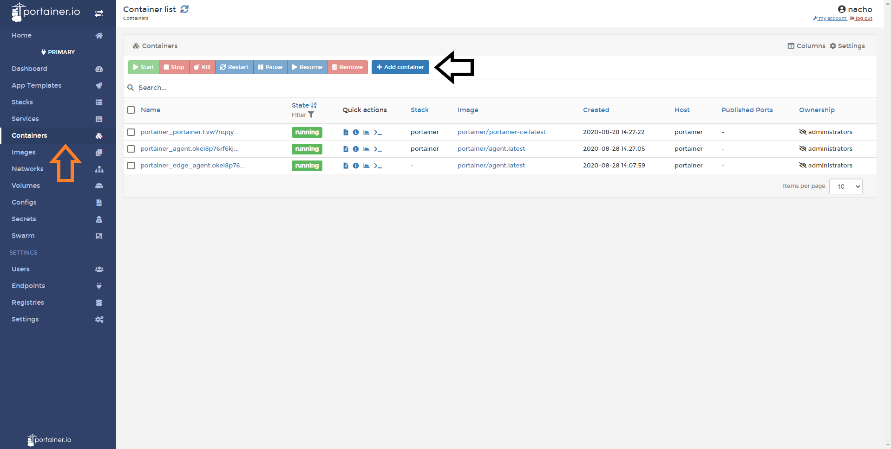
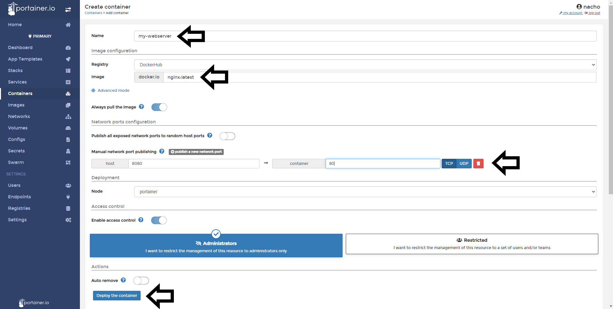
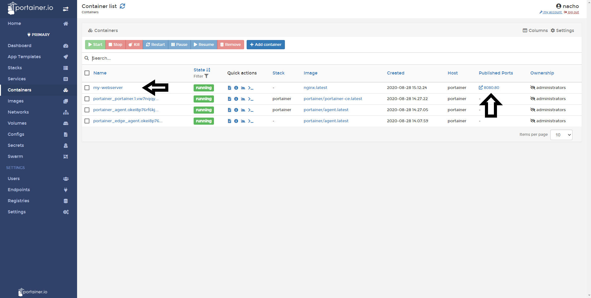

# New Containers

Portainer allows you to deploy a new container direct from the UI with no code required. 

## Deploying a New Container

First select the <b>Endpoint</b> you want to add a container to, then select <b>Containers</b> from the side menu before clicking <b>Add Container</b>.

Add details to your container:

* Name: Friendly name for your container

* Registry: Where your image is hosted

* Image: The name of the image you want to deploy

* Ports: Expose the desired ports

* Advanced Settings: Many options available here to customise the deploymeny from volume and environment configuration to capabilities

Once complete, click <b>Deploy the Container<b/>. 

If successful your container will be shown in the Container List. 

## :material-note-text: Notes

[Contribute to these docs](https://github.com/portainer/portainer-docs/blob/master/contributing.md){target=_blank}