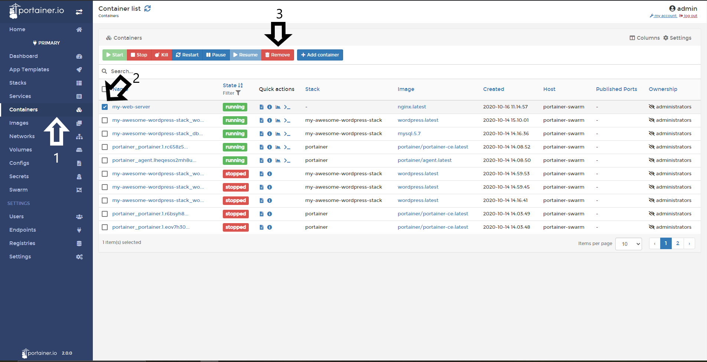
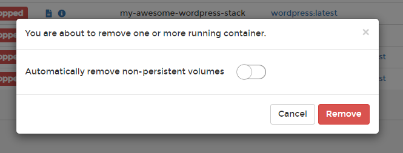

# Delete/Remove a container

In Portainer, you can Remove/Delete containers in a very easy way.

## Deleting Containers

To delete a container, do a click in <b>Containers</b>, then, select the container you want delete and click in <b>Remove</b>

A pop up will be ask for confirmation, also, you need to define if you delete the non persistente volumes, after that, do a click in <b>Remove</b>

Is everything work as expected, you will see a pop up confirming that the container was removed. 

## Notes

[Contribute to these docs](https://github.com/portainer/portainer-docs/blob/master/contributing.md).