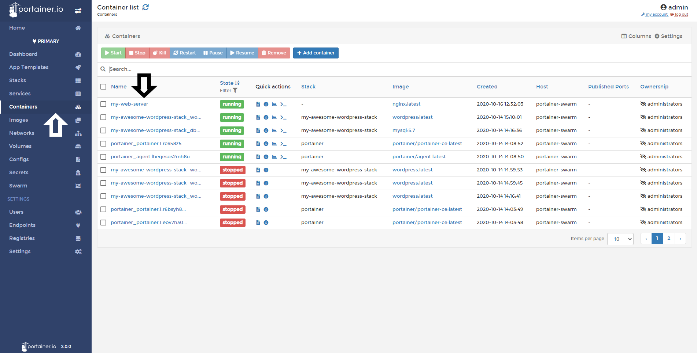
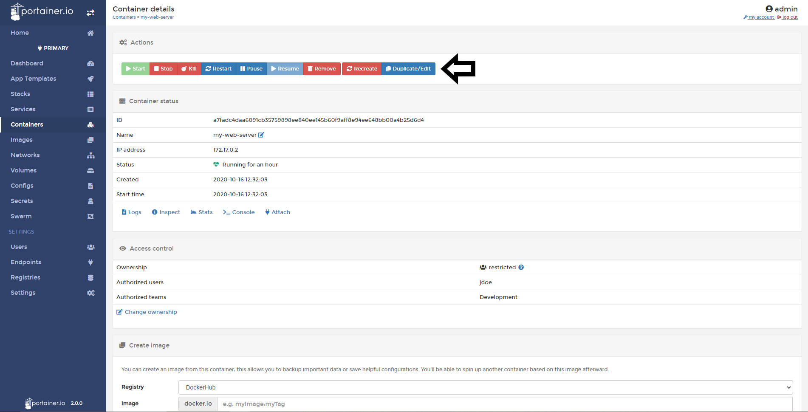
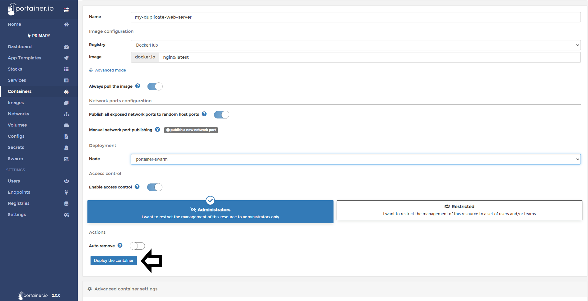
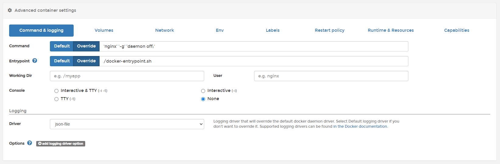
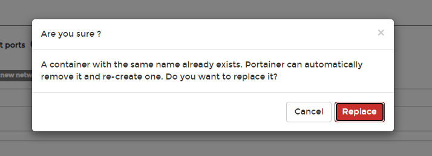
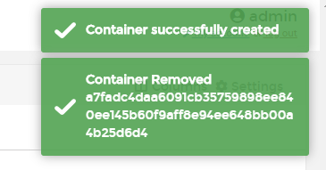

# Duplicate or Edit Containers

In Portainer you have the ability to duplicate and / or edit your containers.

## Duplicate a running container

To duplicate a container, click <b>Containers</b> and then select the container you want to duplicate.

Click <b>Duplicate/Edit</b>.

Change the settings you need, in this example I have changed the name of the container and published a random port, the port exposed by the container by default. When all the changes needed are done, click <b>Deploy the Container</b>

If everything worked as expected, you will see your duplicate container in the containers list. 

## Edit a container

You can change:
* The command & logging options, 
* volumes,
* Networks, 
* Environment Variables, 
* Labels, 
* Restart Policy, 
* Runtime & Resources and 
* Capabilites. 

To change a running container, you need to click <b>Containers</b>, Choose the container you want to change. 

Click <b>Duplicate/edit</b>.

Scrolldown to the bottom of the page and you will see the options to configure to this container. 

When the changes are made, click <b>Deploy Container</b>. You will see a warning about removing and re-creating the current container with the new settings. 

If everything works as expected, you will see a pop up confirming the creation of the new container with the new settings and the removal of the old one. 

## Notes

[Contribute to these docs](https://github.com/portainer/portainer-docs/blob/master/contributing.md).