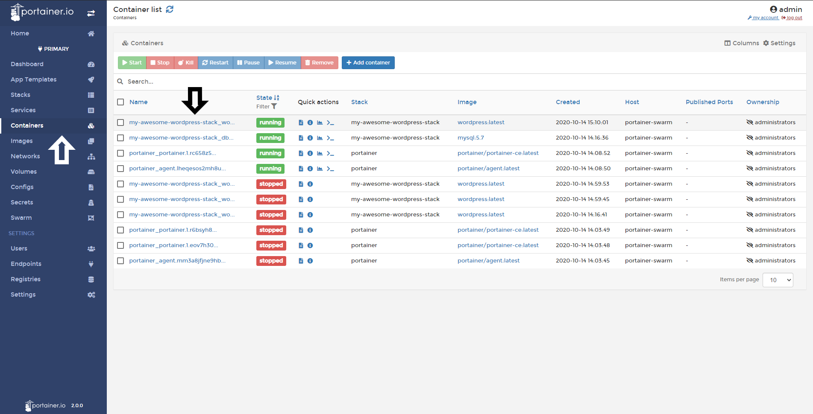
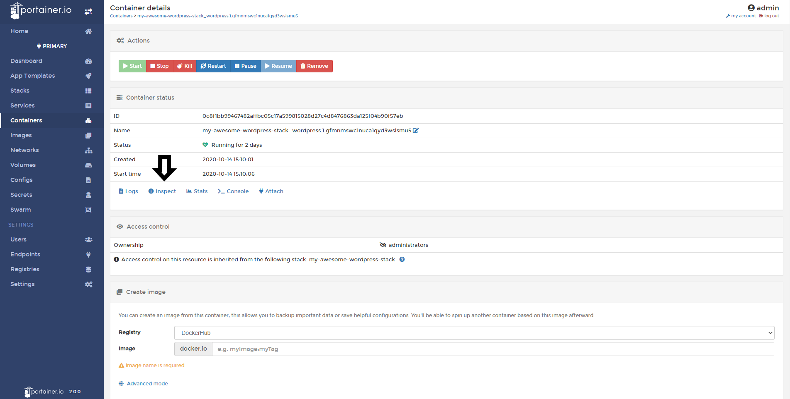
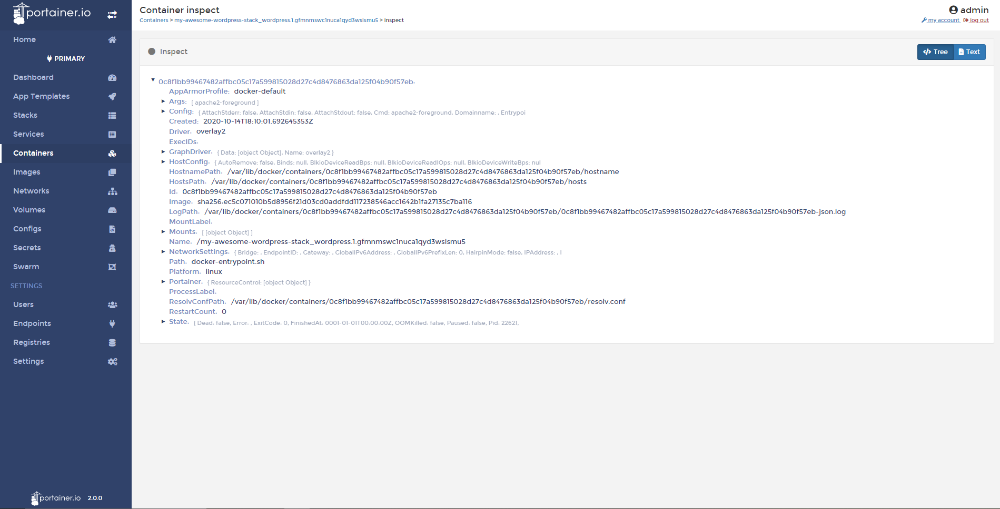

# Inspect a Container

Inspecting a container allows you to view information about your container, such as networking settings, volumes, images, etc.

## Inspecting a Container

To inspect a container, click <b>Containers</b>, select your container and click the <b>Inspect</b> button.

Here, you can view all the information of this container. Clicking on a category will show more information if available. 

## :material-note-text: Notes

[Contribute to these docs](https://github.com/portainer/portainer-docs/blob/master/contributing.md){target=_blank}