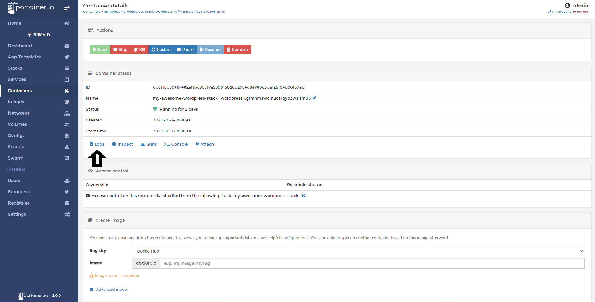
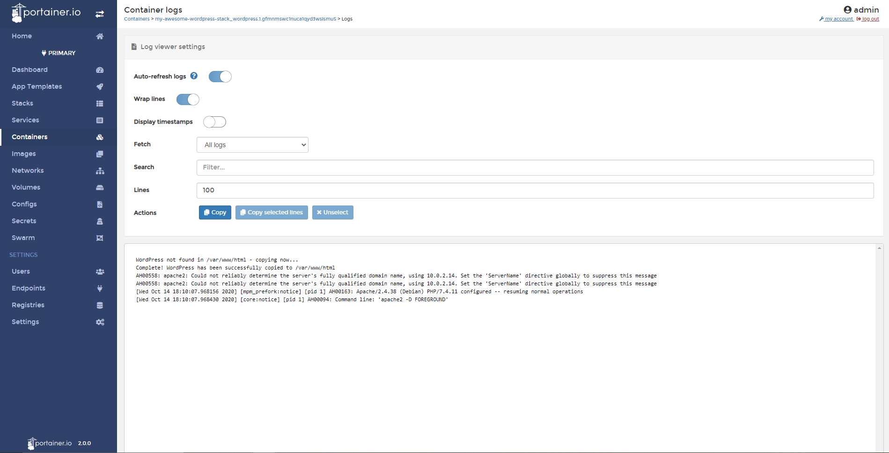

# View Containers Logs

In Portainer, you will able to see the logs from every container. This feature is important to have a single point of troubleshooting our containers. 

## Viewing Containers Logs

To view a container logs, do a click in <b>Containers</b> and then select your container. 

Then, click in <b>Logs</b>

In the following screen, you will see a few options:

* Auto-refresh logs: Disable this option allows you to pause the logs collection process and the auto-scrolling.
* Wrap lines: Is to order the lines of logs to make more easy to read.
* Display timestamps: this options is useful when you need to find specific time and date logs.
* Fetch: This options allows you to filter the logs by day, hours or minutes.
* Search: You can find specific words in the logs. It's very cool option to found specific errors.
* Lines: Specify how much lines you want to the see in the logs. By default is 100. 
* Actions: You can copy all the logs displayed or some lines.

## Notes

[Contribute to these docs](https://github.com/portainer/portainer-docs/blob/master/contributing.md).