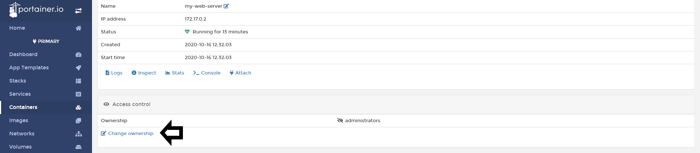
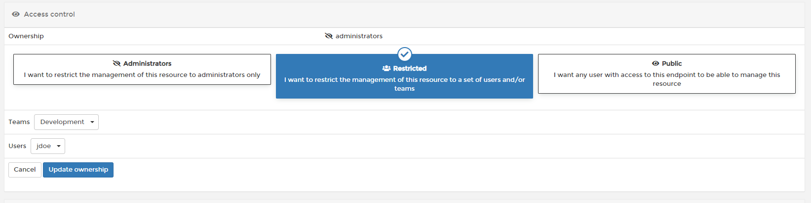
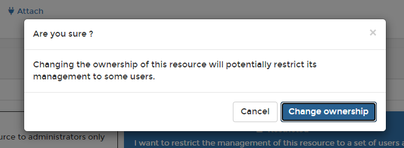
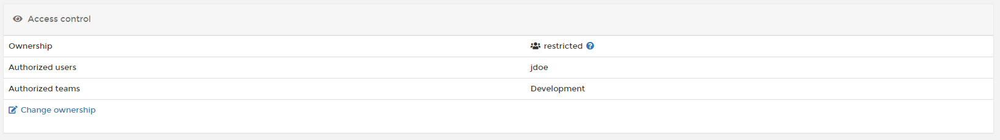

# Change Container Ownership

Portainer allows you to to limit the usage of resources to certains teams or users from the GUI.

## Changing Container Ownership

To change your container ownership, click in <b>Containers</b>, pick the container you want to change the ownership. 

Scroll down to <b>Access Control</b> section and click <b>Change Ownership</b>. 

You will see three options:

* Administrators: This resource is only managed by Portainer Administrators.
* Restricted: Use this option when you want to restrict this resource to a specific Team or User.
* Public: Use this options if you want that anyone that had access to the endpoint can manage this container.

After you define the ownership, click <b>Update Ownership</b>. You will be presented with a warning:

If everything works as expected, you will see a pop up confirming your updates:

After that, you can view your ownership settings applied in the container:

## :material-note-text: Notes

[Contribute to these docs](https://github.com/portainer/portainer-docs/blob/master/contributing.md){target=_blank}