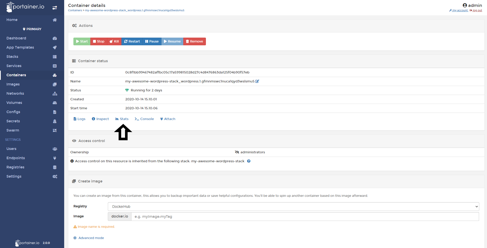
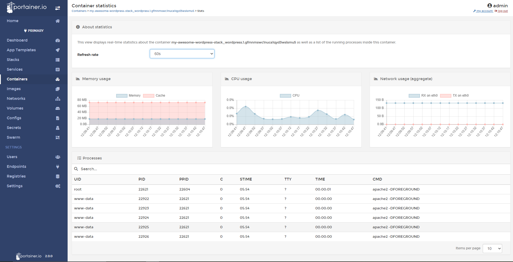

# View Container Stats

The stats are very important to understand the resource consumption of yours containers. In Portainer, you will able to watch how much resources is using a specific container. 

## Viewing Container Stats

To watch a container stats, do a click in <b>Containers</b>, select the container you want to see the stats.

Then, do a click in <b>Stats</b>

Here, you can view in a very comprehensive way the consumptions of your container. You will able to see the following stats:

* Memory Usage
* CPU Usage
* Network Usage: RX and TX
* Process running in the container
* Refresh Rate: You can configure time intervals to get new stats data.

## Notes

[Contribute to these docs](https://github.com/portainer/portainer-docs/blob/master/contributing.md).