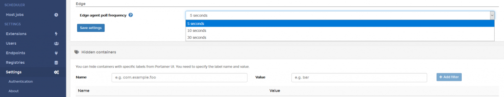

# Edge Agent
In standard deployments, the central Portainer instance and any endpoints it manages are assumed to be on the same network, that is, Portainer and the agents are able to seamlessly communicate to one another. However, in environments where the remote endpoints are on a completely separate network to Portainer, say, across the internet, historically, we would have been unable to centrally manage these devices.

With the new edge agent, we altered the architecture, so that rather than Portainer needing seamless access the remote endpoint, now, only the remote endpoints need to be able to access Portainer. This is important in Internet connected environments where there is no desire to expose the Portainer agent to the internet.

For Edge Agent, Portainer now requires two tcp ports to be exposed; 9000, and 8000. 9000 has historically been the port we served the UI from as well as the Portainer API, but now we have extended the API so that the remote agents can poll for instructions. Port 8000 is a tls tunnel server and is used to create a secure tunnel between the agent and the Portainer instance.

When you create an edge agent in Portainer, two things happen. First, you are prompted for the endpoint name (for us humans to use in the UI), and you are asked to confirm the FQDN:PORT of your Portainer instance. Be sure this is correct as its what your agents will use to connect (so make sure dns resolves etc).Second, we also dynamically generate an edge ID, which is a random UUID assigned to each endpoint. You can see this in the command syntax we provide for your convenience. Note the edge ID and the join token are unique per endpoint.

Note that the edge join token comprises the following encoded data:

* The Portainer instance API URL (this is how the edge agent knows how to "call home" to your Portainer instance)
* The Portainer instance reverse tunnel server address (same as the API URL but with the SSH tunnel server port, 8000 is the default)
* The endpoint identifier key (endpoint ID)
* The Portainer instance reverse tunnel server fingerprint (used when creating a tunnel to prevent MITM)

You now take the convenience command syntax to deploy an edge agent across your remote node or remote swarm cluster.

### Portainer <--> Agent Communication

The agent is configured to POLL the Portainer instance, as defined in the Portainer settings, every 5 seconds (by default); the agent simply says to Portainer "Hi, i am agent <edge_UUID>, my join token is <YYYYYYYYYY>, do you need me at the moment".

Portainer checks its internal database to ensure the edge uuid and join token match. If there is no UUID in the Portainer DB associated to the endpoint's provided join token (endpoint is not associated yet - allowed to accommodate pre-staged agent deployments), Portainer will associate the agent provided UUID to the endpoints join token.

If the UUID/Join Token combo do not match, the connection is rejected, and if they do match, it responds with either "No, i dont need you, please check in again in X seconds" (where x is the agent check-in frequency), or "Yes, i do need you, please connect to me using these tunnel credentials <XXXXXXXXXX>" (where XXXXXXXX is an encrypted randomly generated one-time-use username and password).

**Note:** The tunnel credentials are encrypted by Portainer using the edge_UUID as the encryption key.

The edge agent, on getting confirmation it needs, immediately decrypts the credentials, and establishes a tunnel on port 8000 to the Portainer instance. Note that where the remote endpoint is a swarm cluster, every node of the cluster is running an instance of the agent, and every instance checks in with Portainer. When the "required" flag is raised, the first agent in the cluster to receive this is the agent that establishes the tunnel. Portainer will then be able to query the agent where the tunnel is open. If the tunnel closes for whatever reason (network disruption) then the agent will re-establish it immediately.

The agent keeps a record of when Portainer last communicated with it, and after a period of inactivity (5 minutes), the tunnel will close, and the access credentials are retired. Just before closing the tunnel, the agent takes a snapshot of the current configuration and sends this to Portainer to update its snapshot record.

Now, what triggers Portainer to require the agent to establish a tunnel?

Simple, when an administrator, using the Portainer UI (or API), selects an edge endpoint for interactive management. On clicking, the "you are required flag" is raised, and the UI shows a "connecting to edge endpoint" whilst waiting for the agent to check in and establish its tunnel. Under default settings, this waiting time would be no longer than 10 seconds (5 seconds potential wait time until next check-in, then a few seconds for tunnel to open).

In order to stop premature tunnel termination, whenever an admin has an active session with an edge endpoint, we send "keep alives" every 1 minute, even if the admin is not performing a task (because the admin might be in the middle of a task, get distracted, come back to the task, and rightfully, expect to just continue without error).

Clearly, having many thousands of endpoints checking in with Portainer every 5 seconds places quite a load on the network, and that is right, 324B/s per agent to be exact (per agent, not per endpoint, so keep this in mind); for this reason, we recommend that if you are infrequently needing to administer your edge endpoints, that you change the check-in period. In the settings of Portainer, you can change this to 5, 10, or 30 seconds. Remember, when changing this, if you do want to perform an admin activity, you will see "connecting to the edge agent" for up to 2x the check-in period, so simply drop the time back down before you need to do things.

We load tested Portainer with 15,000 actively connected endpoints, with a check-in frequency of 5 seconds. This generated 7Mbps of network traffic to the Portainer instance, and Portainer needed 4 CPUs to handle the encryption / tunnel load.

This edge agent release is our first attempt at massive scale centralised management, so we will continue to refine and improve things, with a view to reducing the network overhead of the check-in process.

 
## :material-note-text: Notes

[Contribute to these docs](https://github.com/portainer/portainer-docs/blob/master/contributing.md){target=_blank}