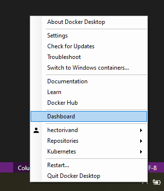

# Deploy Portainer in Windows 10

## Deploy Portainer in Kubernetes through Docker Desktop. 

You can deploy Portainer in a Kubernetes environment in Windows using Docker Desktop. Note: This scenario is for testing purpose only.

### Enable Kubernetes in Docker Desktop

To enable Kubernetes in Docker Desktop, you need to open the dashboard of Docker Desktop. Right click the Docker icon in the system tray and click "dashboard"

Click Settings:

1. Select Kubernetes 2. Select 'Enable Kubernetes' 3. Click 'Apply and Restart'. 

After a few minutes, you will see that Kubernetes is running:

### Deploy Portainer using YAML Manifest

First create the Portainer namespace in your cluster

<pre><code> kubectl create namespace portainer</code></pre>

#### For NodePort
<pre><code> kubectl apply -n portainer -f https://raw.githubusercontent.com/portainer/k8s/master/deploy/manifests/portainer/portainer.yaml</code></pre>

If everything work as expected, you can navigate to Portainer from the browser with the address http://localhost:30777

#### For Load Balancer
<pre><code>kubectl apply -n portainer -f https://raw.githubusercontent.com/portainer/k8s/master/deploy/manifests/portainer/portainer-lb.yaml</code></pre>

## Deploy Portainer in Docker

Portainer is comprised of two elements, the Portainer Server, and the Portainer Agent. Both elements run as lightweight Docker containers on a Docker engine or within a Swarm cluster. Due to the nature of Docker, there are many possible deployment scenarios, however, we have detailed the most common below. Please use the scenario that matches your configuration.

Note that the recommended deployment mode when using Swarm is using the Portainer Agent.

Please see the [requirements](/v2.0/deploy/requeriments.md) page for further info .

### Docker Standalone in WSL2

Before you can deploy Portainer in Docker Standalone running in Windows, you need to install WSL. [Read this guide to know more about WSL/WSL2](https://docs.microsoft.com/en-us/windows/wsl/install-win10)

Use the following Docker commands to deploy the Portainer Server; note the agent is not needed on standalone hosts, however it does provide additional functionality if used (see portainer and agent scenario below):

<pre><code> docker volume create portainer_data</code></pre>

<pre><code> docker run -d -p 8000:8000 -p 9000:9000 --name=portainer --restart=always -v /var/run/docker.sock:/var/run/docker.sock -v portainer_data:/data portainer/portainer-ce</code></pre>

### Docker Swarm in WSL2

Deploying Portainer and the Portainer Agent to manage a Swarm cluster is easy! You can directly deploy Portainer as a service in your Docker cluster. Note that this method will automatically deploy a single instance 
of the Portainer Server, and deploys the Portainer Agent as a global service on every node in your cluster.

Remember to initiate the Docker Swarm mode when you use Docker Desktop. You can do this running the following command:

<pre><code> docker swarm init</code></pre>

The terminal will reply with this:

<pre><code>Swarm initialized: current node (15gbf4d66mvzk3die00sgirpf) is now a manager.

To add a worker to this swarm, run the following command:

    docker swarm join --token SWMTKN-1-096qbnf2b9yywagu5ht3731zlpkeqazgctffolntsiljfp0m34-c4snnxplgwq2bd1ohta8k48b9 192.168.65.3:2377

To add a manager to this swarm, run 'docker swarm join-token manager' and follow the instructions.</code></pre>

Once this is done, you can continue with the installation running the following command:

<pre><code> curl -L https://downloads.portainer.io/portainer-agent-stack.yml -o portainer-agent-stack.yml</code></pre>
<pre><code> docker stack deploy -c portainer-agent-stack.yml portainer</code></pre>

### Docker Standalone using Windows Containers

Another scenario is running Docker in Windows is running Windows Containers. This is a feature that has to be enabled. To do this, open a PowerShell window as administrator and run:

<pre><code>Enable-WindowsOptionalFeature -Online -FeatureName containers -All</code></pre>

Once this is done, you need to open a PowerShell console and run the following commands:

<pre><code> docker volume create portainer_data</code></pre>
<pre><code> docker run -d -p 9000:9000 --name portainer --restart always -v \\.\pipe\docker_engine:\\.\pipe\docker_engine -v portainer_data:C:\data portainer/portainer-ce</code></pre>

Now, you can navigate to http://localhost:9000 and start using Portainer.

### Docker Swarm using Windows Containers

You can use our YML manifest to run Portainer in Windows using Windows Containers. In a Powershell windows, you must run:

<pre><code> curl https://downloads.portainer.io/portainer_windows_stack.yml -o portainer_windows_stack.yml</code></pre>
<pre><code> docker stack deploy --compose-file=portainer_windows_stack.yml portainer</code></pre>

## Deploy Portainer Agent in Windows running WSL

### Docker Standalone
Run the following command to deploy the Agent in your Docker host.

<pre><code>docker run -d -p 9001:9001 --name portainer_agent --restart=always -v /var/run/docker.sock:/var/run/docker.sock -v /var/lib/docker/volumes:/var/lib/docker/volumes portainer/agent</code></pre>

### Docker Swarm
Deploy Portainer Agent on a remote LINUX Swarm Cluster as a Swarm Service, run this command in a manager node in the remote cluster.

<pre><code> docker service create --name portainer_agent --network portainer_agent_network --publish mode=host,target=9001,published=9001 -e AGENT_CLUSTER_ADDR=tasks.portainer_agent --mode global --mount type=bind
src=//var/run/docker.sock,dst=/var/run/docker.sock --mount type=bind,src=//var/lib/docker/volumes,dst=/var/lib/docker/volumes –-mount type=bind,src=/,dst=/host portainer/agent</code></pre>

## Deploy Portainer Agent in Windows using Windows Containers.

### Docker standalone

To run Portainer Agent in a Windows Container scenario, you need to execute the following commands:

<pre><code>docker run -d -p 9001:9001 --name portainer_agent --restart=always -v \\.\pipe\docker_engine:\\.\pipe\docker_engine portainer/agent</code></pre>

## Notes

These deployments were tested in Windows 10 Pro 2004 edition. To use Windows Containers, you need to run Windows 10 ver 1803 or newest.

[Contribute to these docs](https://github.com/portainer/portainer-docs/blob/master/contributing.md).