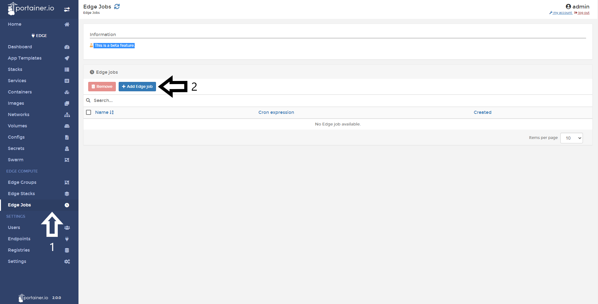

# Add an Edge Job

Adding an Edge Job is an excellent way to schedule jobs in your Edge hosts. This can be used to run any scripts you need, for example, run a backup in a determined period of time. 

<b>Note</b>: This is a beta feature.

<b>Note 2</b>: Computing features needs to be enabled. Take a look at this section in our [admin guide](/v2.0/settings/edge/#enabling-edge-compute-features).

## Adding an Edge Job

To add a job, click <b>Edge Jobs</b> and then <b>Add Edge job</b>.

Then 1. Name your job and 2. Choose between the following two options:

* Basic Configuration: Select a date from a calendar
* Advanced Configuration: Write your own CRON rule.

* Select if this job is a recurring job and enter the job time.

You can then use the web editor to write or paste the script.

1. Select the target endpoints.
2. To create and run the job click Create edge job.

# Notes

[Contribute to these docs](https://github.com/portainer/portainer-docs/blob/master/contributing.md).