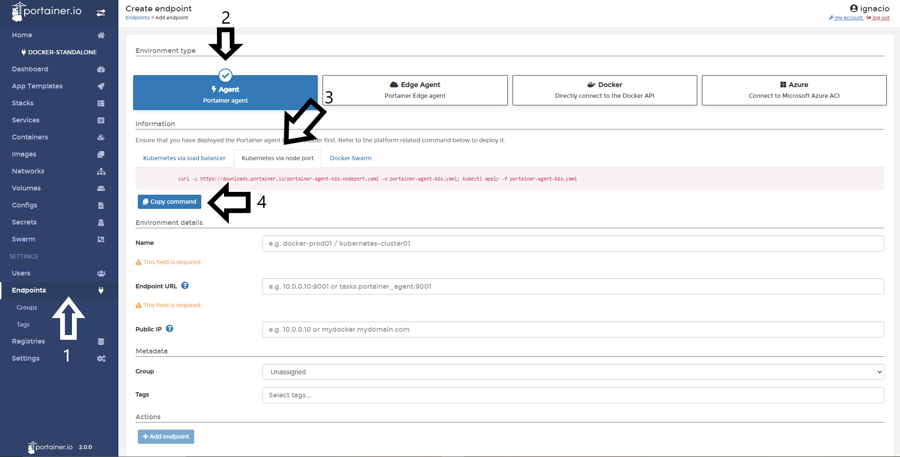
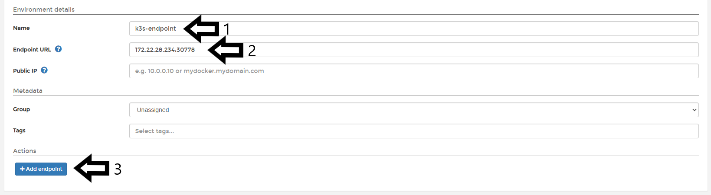
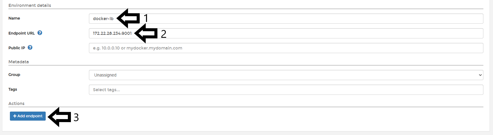

# Add Kubernetes Endpoint

Adding Kubernetes endpoints to Portainer CE 2.0 is very straightforward. As a requirement you need to define if you are going to deploy the Agents for Kubernetes via NodePort or Load Balancer. In this guide, you will see how to deploy in both scenarios.

You can view the supported Kubernetes versions in this [page](/v2.0/deploy/requirements/#supported-kubernetes-versions).
For more information on supported Kubernetes Versions please view the [Requirements](/v2.0/deploy/requirements.md) page.

## Add Kubernetes Endpoint via NodePort.

### Deploying the Agent.

Once logged into Portainer go to 1. <b>Endpoints</b> 2. Select <b>Agent</b> from <b>Environment Type</b> section. 3. Select <b>Kubernetes via Node Port</b> in the tabbed Information section, 4. Copy the command.
Note: It is important to fill the environment details by first running the command in the Kubernetes node.

This command is the same each time you want to add a new Kubernetes Endpoint via NodePort:

<pre><code>curl -L https://downloads.portainer.io/portainer-agent-k8s-nodeport.yaml -o portainer-agent-k8s.yaml; kubectl apply -f portainer-agent-k8s.yaml</code></pre>

Once is running in the Kubernetes host, the terminal is going to reply with something like this:  

<pre><code>  % Total    % Received % Xferd  Average Speed   Time    Time     Time  Current
                                 Dload  Upload   Total   Spent    Left  Speed
100  1617  100  1617    0     0    846      0  0:00:01  0:00:01 --:--:--   845
namespace/portainer created
serviceaccount/portainer-sa-clusteradmin created
clusterrolebinding.rbac.authorization.k8s.io/portainer-crb-clusteradmin created
service/portainer-agent created
service/portainer-agent-headless created
deployment.apps/portainer-agent created</code></pre>

To validate if the Agent is running, you can run the following command:

<pre><code> kubectl get pods --namespace=portainer</code></pre>

The result of that command should be something like this:

<pre><code>NAME                               READY   STATUS    RESTARTS   AGE
portainer-agent-5988b5d966-bvm9m   1/1     Running   0          15m</code></pre>

Now, we're ready to move on to the next step.

### Finishing the configuration.

Once the Agent is running in the Kubernetes host, you need to fill the <b>environment details</b>. The following options are available:

* Name: This is a descriptive name for your endpoint. This field is required.
* Endpoint URL: Define your IP or name to connect to the endpoint (Kubernetes host) and specify the port (30778) if this is needed. This field is required.
* Public IP: URL or IP address where exposed containers will be reachable. This field is optional and will default to the endpoint URL.

In the <b>Metadata</b> section, you can define a <b>group</b> and <b>tags</b> for this endpoint.

See the following screenshot for reference.

Once everything is set click <b>Add Endpoint</b>. You will then see the final configuration screen (below).

In this screen, you can set the following options:

* Allow users to use external load balancer: Enabling the load balancer feature will allow users to expose an application they deploy over an external IP address assigned by cloud provider.
* Ingress controller: Adding ingress controllers will allow users to expose an application they deploy over an HTTP route.
* Enable features using metrics server: Enabling this feature will allow users to use specific features that leverage the metrics server component.
* Available storage options: Select which storage options will be available for use when deploying applications. Have a look at your storage driver documentation to figure out which access policy to configure and if the volume expansion capability is supported. The options in the sections are:
  - Local-path: In this scenario your applications will be stored in the node.
  - Shared Access Policy: RWO or RWX
  - Volume Expansion: Enable the option to expand the persistent storage of the pods. 

You can find more information about access modes in the [official Kubernetes documentation](https://kubernetes.io/docs/concepts/storage/persistent-volumes/#access-modes).

See the following screenshot for reference:

Once this has all been set, click <b>Save Configuration</b>. Congratulations! Your Kubernetes endpoint was added.

## Add Kubernetes Endpoint via Load Balancer

### Deploying the Agent.

Once you login to Portainer, you need go to <b>Endpoints</b> and pick in the <b>environment type</b> section, <b>Agent</b>.

In the tab below to the information section, you need pick <b>Kubernetes via Load Balancer</b> and copy the command displayed in the page. Note: Is important run the command in the Kubernetes node before to fill the environment details.

The command in this scenario is the same of each time you want to add a new Kubernetes Endpoint via Load Balancer to Portainer. The command is the following:

<pre><code>curl -L https://downloads.portainer.io/portainer-agent-k8s-lb.yaml -o portainer-agent-k8s.yaml; kubectl apply -f portainer-agent-k8s.yaml</code></pre>

Once is running in the Kubernetes host, the terminal is going to reply with something like this:

<pre><code>  % Total    % Received % Xferd  Average Speed   Time    Time     Time  Current
                                 Dload  Upload   Total   Spent    Left  Speed
100  1617  100  1617    0     0    846      0  0:00:01  0:00:01 --:--:--   845
namespace/portainer created
serviceaccount/portainer-sa-clusteradmin created
clusterrolebinding.rbac.authorization.k8s.io/portainer-crb-clusteradmin created
service/portainer-agent created
service/portainer-agent-headless created
deployment.apps/portainer-agent created</code></pre>

To validate is the Agent is running, you can run the following command:

<pre><code> kubectl get pods --namespace=portainer</code></pre>

The result of that command should be something like this:

<pre><code>NAME                               READY   STATUS    RESTARTS   AGE
svclb-portainer-agent-52xrp        1/1     Running   0          2m26s</code></pre>

Now, we're ready to move on to the next step.

### Finishing the configuration.

Once the Agent is running in the Kubernetes host, you need to fill the <b>environment details</b>. The following options are available:

* Name: This is a descriptive name for your endpoint. This field is required.
* Endpoint URL: Define your IP or name to connect to the endpoint (Kubernetes host) and specify the port (9001) if this is needed. This field is requiered.
* Public IP: URL or IP address where exposed containers will be reachable. This field is optional and will default to the endpoint URL.

In the <b>Metada</b> section, you can define a <b>group</b> and <b>tags</b> for this endpoint.

See the following screenshot for reference.

When everything is set, you only need to click in <b>Add Endpoint</b> button. If everything work as expected, you will see the last screen for configuration. 

In this screen, you can set the following options:

* Allow users to use external load balancer: Enabling the load balancer feature will allow users to expose application they deploy over an external IP address assigned by cloud provider.
* Ingress controller: Adding ingress controllers will allow users to expose application they deploy over a HTTP route.
* Enable features using metrics server: Enabling this feature will allow users to use specific features that leverage the metrics server component.
* Available storage options: Select which storage options will be available for use when deploying applications. Have a look at your storage driver documentation to figure out which access policy to configure and if the volume expansion capability is supported. The options in the sections are:
  - Local-path: In this scenario your applications will be storaged in the node.
  - Shared Access Policy: RWO or RWX
  - Volume Expansion: Enable the option to expand the persistent storage of the pods. 

You can find more information about access modes in the [official Kubernetes documentation](https://kubernetes.io/docs/concepts/storage/persistent-volumes/#access-modes).

See the following screenshot for reference:

Once all is set, you must click in <b>Save Configuration</b> button. Congratulations. You Kubernetes endpoint via Load Balancer was added.

## :material-note-text: Notes

[Contribute to these docs](https://github.com/portainer/portainer-docs/blob/master/contributing.md){target=_blank}