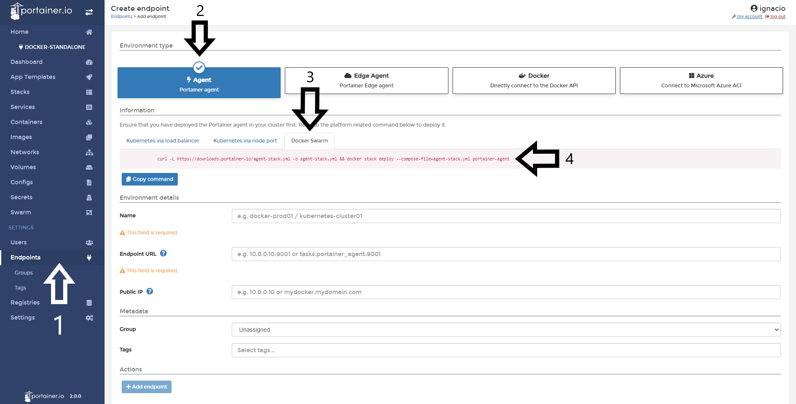
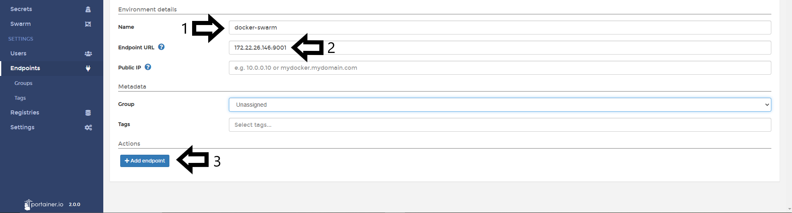

# Add a Docker Swarm Endpoint

Add a Docker Swarm Endpoint is very straighforward in Portainer CE 2.0. 

## Deploy the Agent.

Once you login to Portainer, you need go to <b>Endpoints</b> and pick in the <b>environment type</b> section, <b>Agent</b>.

In the tab below to the information section, you need pick <b>Docker Swarm</b> and copy the command displayed in the page. Note: Is important run the command in the Docker Swarm host before to fill the environment details. 

The command in this scenario is the same of each time you want to add a new Docker Swarm endpoint to Portainer. The command is the following:

<pre><code>curl -L https://downloads.portainer.io/agent-stack.yml -o agent-stack.yml && docker stack deploy --compose-file=agent-stack.yml portainer-agent</code></pre>

Once is running in the Docker Swarm host, the terminal is going to reply with something like this:

<pre><code>  % Total    % Received % Xferd  Average Speed   Time    Time     Time  Current
                                 Dload  Upload   Total   Spent    Left  Speed
100   484  100   484    0     0    249      0  0:00:01  0:00:01 --:--:--   249
Creating network portainer-agent_portainer_agent
Creating service portainer-agent_agent</code></pre>

To validate is the Agent is running, you can run the following command:

<pre><code>$ docker service ls</code></pre>

The result of that command should be something like this:

<pre><code>ID                  NAME                    MODE                REPLICAS            IMAGE                    PORTS
tshb6ee2710s        portainer-agent_agent   global              1/1                 portainer/agent:latest</code></pre>

Now, we're ready to move on to the next step.

## Finishing the configuration

Once the Agent is running in the Docker Swarm host, you need to fill the <b>environment details</b>. The following options are available:

* Name: This is a descriptive name for your endpoint. This field is required.
* Endpoint URL: Define your IP or name to connect to the endpoint (Docker Swarm Host) and specify the port (9001) if this is needed. This field is requiered.
* Public IP: URL or IP address where exposed containers will be reachable. This field is optional and will default to the endpoint URL.

In the <b>Metada</b> section, you can define a <b>group</b> and <b>tags</b> for this endpoint.

See the following screenshot for reference. 

When everything is set, you only need to click in <b>Add Endpoint</b> button. If everything work as expected, you will see the next pop up at the top right corner.

## Notes

Do you think that is missing something here? Contribute with this admin guide forking the repo [Portainer-Docs](https://github.com/portainer/portainer-docs) and propose changes.