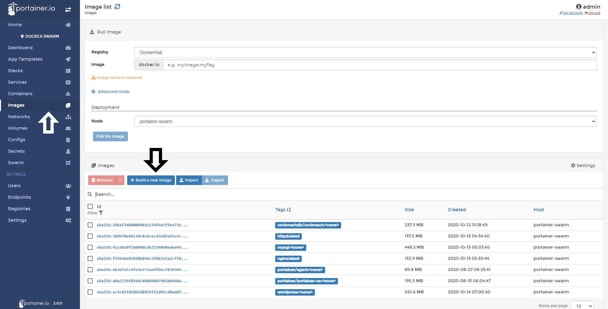
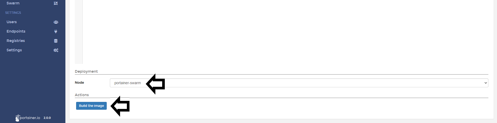

# Build Image

Portainer allows you to create/build new images from a friendly UI. You can define your build in three ways:

* Web Editor: You can use our web editor to build your image.
* Upload: If you already have a dockerfile, you can upload to Portainer to build that image.
* URL: If the dockerfile is hosted in Internet, you can download directly to Portainer and build the image.

## Building an Image using our web editor

Go to <b>Images</b> and click <b>Build a new image</b>.

In the next screen, you need to define a <b>name</b> for your image and start to write your dockerfile in the editor.

<b>Note</b>: You can define <b>multiple names</b> for you image.

When you're ready, scrolldown, select the <b>node</b> you going to save the image to and click <b>Build the image</b>

When the building process is complete, you need to click in the tab <b>Output</b> and you will see the build history and the result. If everything works as expected, you will see a similar output to this:

## Notes

[Contribute to these docs](https://github.com/portainer/portainer-docs/blob/master/contributing.md).