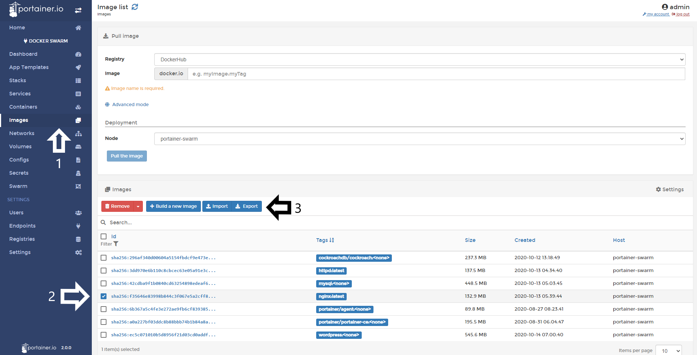
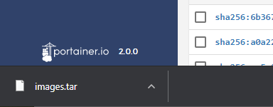

# Export Images

From Portainer UI you can export any Docker image that is store in any node. This is useful when you need to move a container from a one host or another or simply make backup of the images. 

<b>Note</b>: Be advised that when you export a container to a tar file, the volumes are not exported with it. You need to save the data from that volumes in a another way.

## Exporting Images

To export images, do a click in <b>Images</b>, select the image you want to export and do a click in <b>Export</b>.

You will see a pop up warning you about that the exportation may take several minutes. This depends of the size of your image. Do a click in <b>Continue</b>.

When the process is ready you will see a pop up at the top right corner and also, you will see that your image is downloading:

## Notes

[Contribute to these docs](https://github.com/portainer/portainer-docs/blob/master/contributing.md).