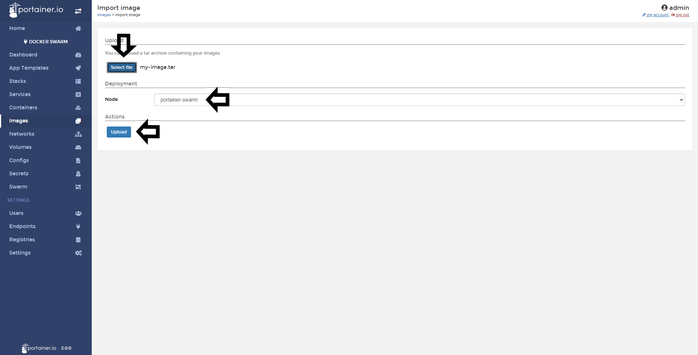

# Import Images

Portainer is capable to import the images that you created in another Portainer instance or in the CLI of Docker and Docker Swarm.

## Importing Images

To import an image using Portainer, go a <b>Images</b> and then do a click in <b>Import</b>.

Select your image, select the node where you will save the image and do a click in <b>Upload</b>.

Once the image are uploaded, you will see the following pop up:

## Notes

[Contribute to these docs](https://github.com/portainer/portainer-docs/blob/master/contributing.md).