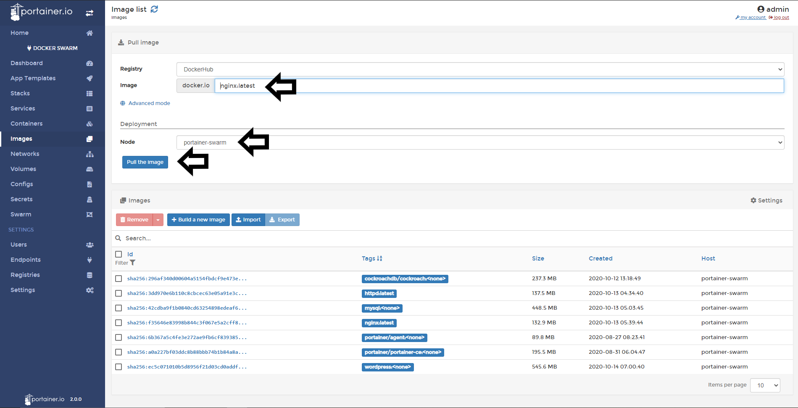
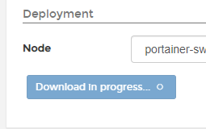
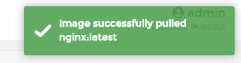

# Pull Images

From the Portainer UI you can pull images from any registry. This option is only available, at this moment, when you manage Docker and Docker Swarm environments.

## Pulling Images

### Pulling in Simple Mode

To pull images from Docker Hub or another registry that you connect before in Portainer. Go to <b>Images</b> and then type the name of the image, select the node when the image is going to be downloaded and click in <b>Pull the Image</b>.

When the image is sucessful downloaded, you will see a pop up at the right top corner.

To see how to add new registries to Portainer, [click here](/v2./registries/connect/).

### Pulling in Advanced Mode

Another option to download images is in <b>Advanced Mode</b>. The difference with the <b>Simple Mode</b> is the possibility to define a custom registry URL, port and image. This use case is ideal when you run your own private registry.

To pull images, go to <b>Images</b> click in Advanced Mode and then, define your registry, port and image, also, you need to specify the node where the image is going to be downloaded and do a click in <b>Pull the Image</b>

When the image is sucessful downloaded, you will see a pop up at the right top corner.

## Notes

[Contribute to these docs](https://github.com/portainer/portainer-docs/blob/master/contributing.md).
