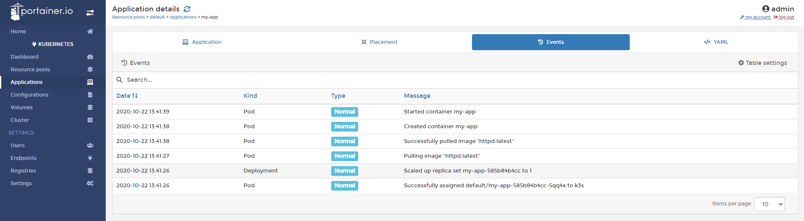
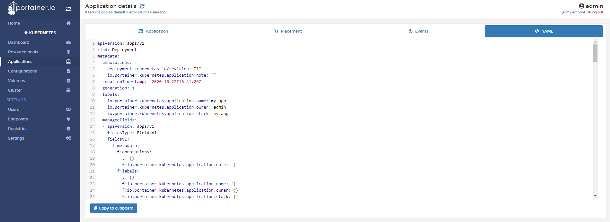

# Inspect Application.

From Portainer, you can see a lot of details about your application running in a cluster. 
To access to this information click <b>Applications</b> and then click the application you want to inspect.

## Application information

In the tab <b>Application</b>, you can find the following information:

* Name: Name of the application.
* Stack: Name of the stack that this container belongs.
* Resource Pool: In what resouce pool / Namespace this application in running.
* Application Type.
* Status: See if the application is running.
* Creation: Information about who and when the application was created.

You can also find specific configuration of this application:

* Port published: Show what port is published from this container.
* Auto Scaling: Show if this application has an auto scaling policy defined.
* Configuration: Here, we can see if the application has a special configuration defined.
* Data Persistence: Here we can see what directories are persitent.

In the Application container section you can see the pod that runs your application, what the image is using, status, node and information about when it was created. Also, you can access the logs or the console of this Pod.

## Placement

In this tab, you will find information what node your application is running in.

## Events

This shows find information about the events related of your container.

## YML

In this section, you can find the YML generated from the deployment of your application using Portainer. This is very useful to create "backups" of your configuration.

## Notes

[Contribute to these docs](https://github.com/portainer/portainer-docs/blob/master/contributing.md).