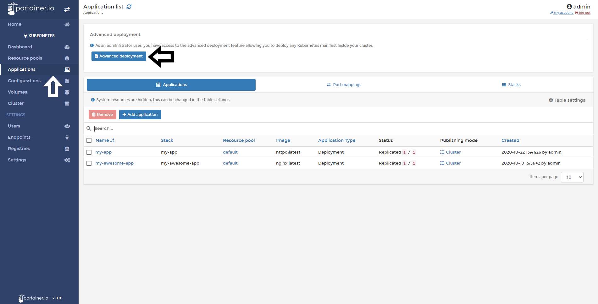
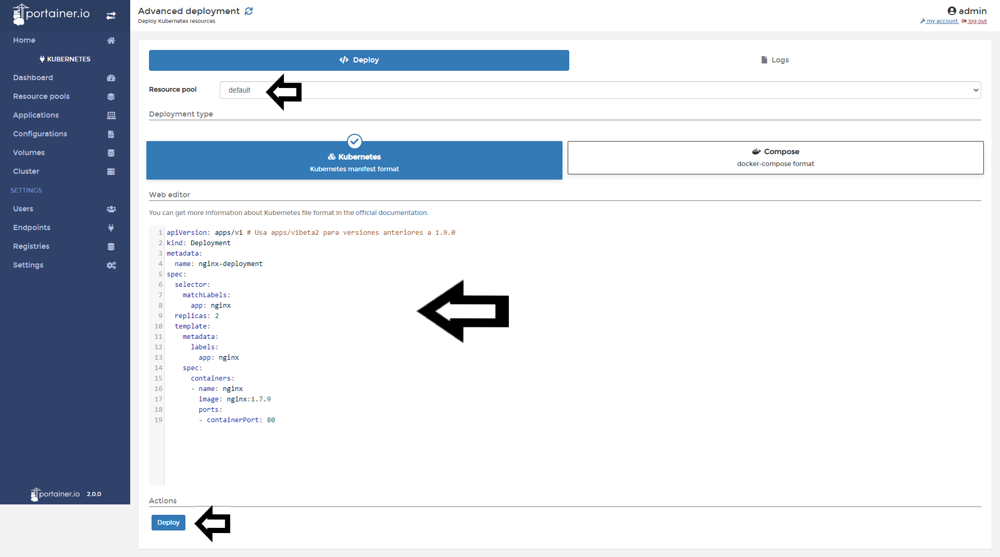

# Deploy an App from a manifest

In Portainer you can launch new applications using your current manifest in YML for K8s or convert from a docker-compose file format. 

<b>Note</b>: Portainer uses Kompose to convert your Compose manifest to a Kubernetes compliant manifest. Be wary that not all the Compose format options are supported by Kompose at the moment.

## Deploying an App from a Kubernetes Manifest.

To start, click <b>Applications</b> and then <b>Advanced Deployment</b>.

In this section, you need to define the resource pool where your applications are going to be deployed and start to write or paste your Kubernetes Manifest. Once this is done, click <b>Deploy</b>.

If everything works as expected you will see this pop up:

## :material-note-text: Notes

[Contribute to these docs](https://github.com/portainer/portainer-docs/blob/master/contributing.md){target=_blank}