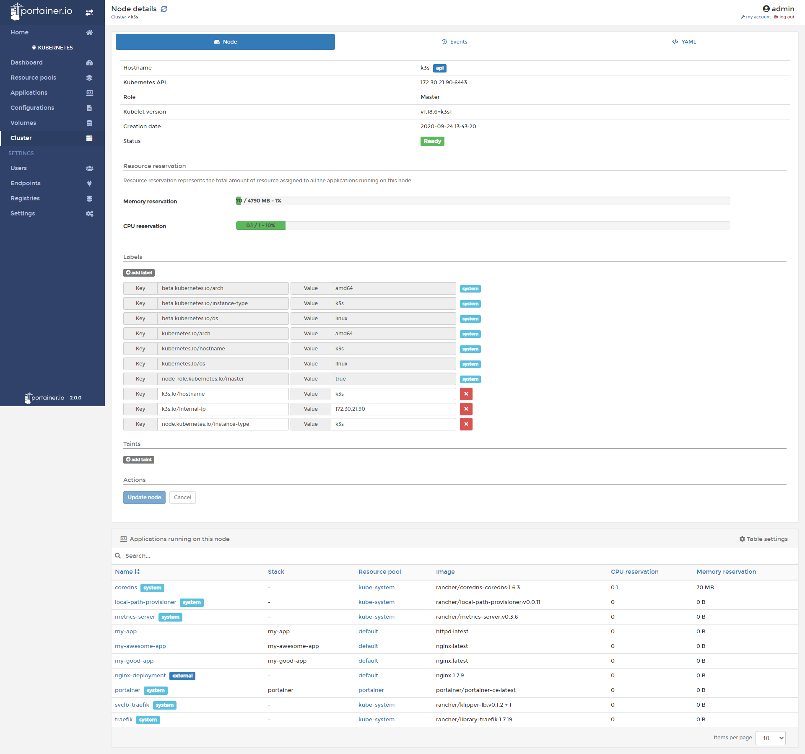
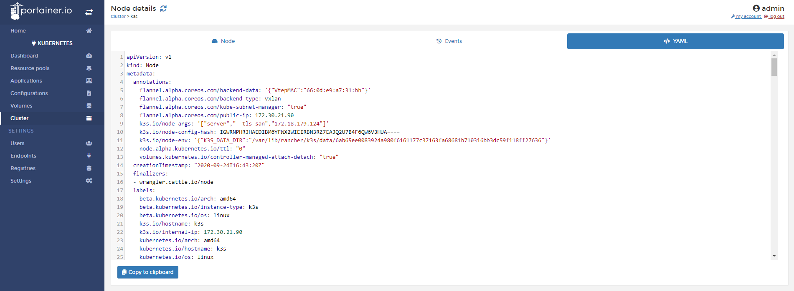

# Inspect the Cluster

From Portainer, you will capable to inspect the cluster. In this help article you will learn how to inspect the Kubernetes cluster from Portainer.

## Inspecting the cluster

Do a click in <b>Cluster</b> and you will see information about this cluster. 

* Memory Reservation: You will see the memory used and available of this cluster.
* CPU Reservation: You will see how much CPU reserved is used. 
* Client Satus: You will see in the components are healthy of they have some problems.
* Leader Status: You will see if this node is a Leader or not.

In the bottom of the page, you will see information about the nodes that're part of this cluster. 

Name, Role, CPU, Memory, Version of Kubernetes, IP Address.

## Inspecting nodes

### Node

When you click in a node, you can inspect it. You will find the following information:

* Hostname
* Kubernetes API Por
* Role
* Kubelet Version
* Creation date
* Status

Also, you will find memory and CPU reservation.

* Labels
* Applications running on the node.

### Events

In this tab, you will see information about the events related to your node. 

### YAML

In this tab, you will find the configuration of your node in YAML format. You can copy the content and saving in a file to mantain a backup of the node configuration.

## Notes

[Contribute to these docs](https://github.com/portainer/portainer-docs/blob/master/contributing.md).