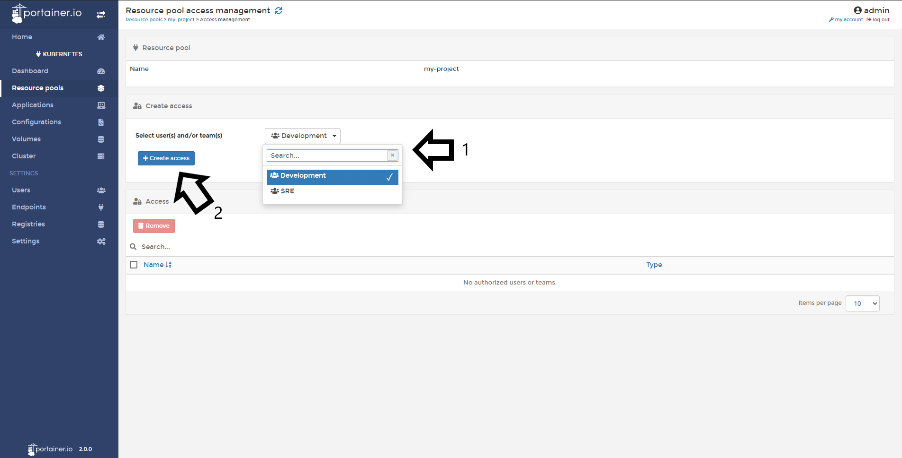

# Manage access to a Namespace/Resource Pool

!!! Warning "Access Control & RBAC"
    Kubernetres RBAC needs to enabled and working for Access Control to work properly in Portainer.

In this help article, you will learn how to manage access to created resource pools.

## Managing access

Click <b>Namespaces/Resource Pools</b> then click <b>Manage Access</b> of the Namespace/Resource Pool you want.

Select the user(s) and or team(s) to add and click <b>Create Access</b>.

If everything works as expected, you will see this pop up confirming your action.

## :material-note-text: Notes

[Contribute to these docs](https://github.com/portainer/portainer-docs/blob/master/contributing.md){target=_blank}