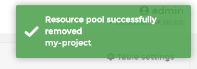

# Delete/Remove a Resource Pool

When you finished your project, you can delete this resource pool and free the resources.

## Removing a Resouce Pool

Do a click in <b>Resouce Pools</b>, select the resource pool and do a click in <b>Remove</b>.

You need to confirm this action:

If everything work as expected, you wil see a pop up confirming your action.

## Notes

[Contribute to these docs](https://github.com/portainer/portainer-docs/blob/master/contributing.md).