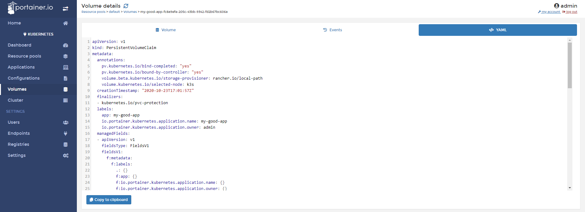

# Inspect a volume

In Portainer, you will capable to inspect volumes that you mounted in Kubernetes Pod.

## Inspecting a Volume

To inspect a volume, go to <b>Volumes</b> and the choose the volume you want inspect.

In a first view, you will able to see the following data:

* Resource pool where this volume was saved
* Used By: Name of the app that's using the volume
* Storage: What is the storage
* Size  
* Created: Information about who and when was created.

After you click in the volume, you will see three tabs, in the first one, you will information about the volume itself.

In the tab <b>events</b>, you will see the events related to this volume:

And the YAML tab, you will see the configuration of this volume in YAML format. From this tab, you can copy the content and save in a file. 

## Notes

[Contribute to these docs](https://github.com/portainer/portainer-docs/blob/master/contributing.md).