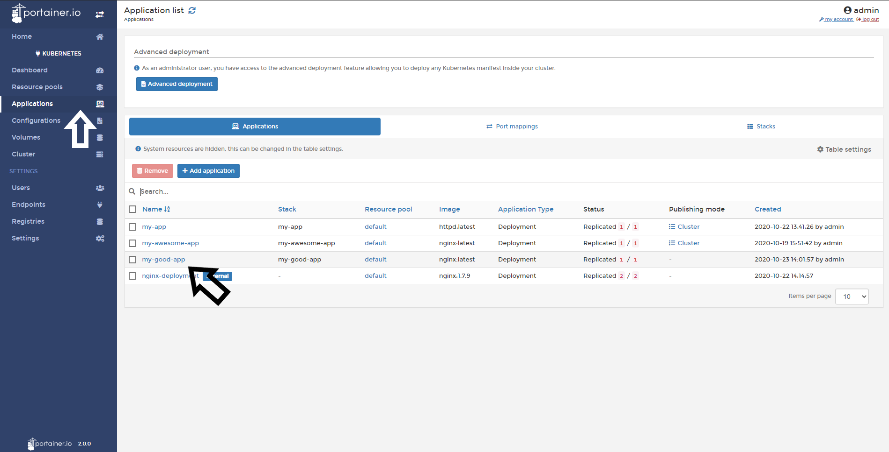
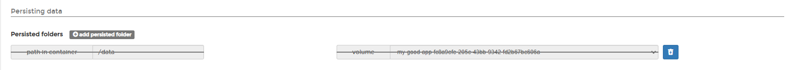
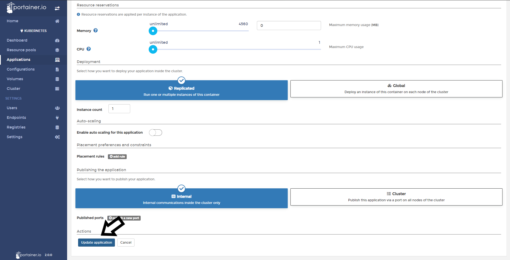
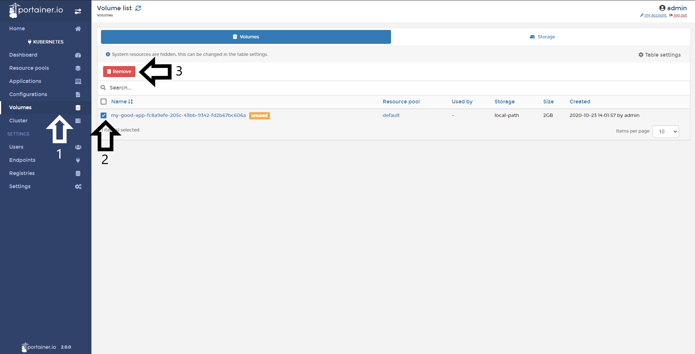

# Remove a Volume

In portainer you can remove volumes, but please note the volume needs to be unattached from any container beforehand.

## Unattaching a volume from a container

To remove the volume that is attached to a container, go to <b>Applications</b> and select the App.

Click <b>Edit this application</b>.

Scroll down to the section <b>Persisting Data</b> and click the trash basket icon. 

You will see the volume label with a strikethrough effect.

Scroll down anc click <b>Update Application</b>.

A warning will pop up. Click <b>Update</b> to confirm.

# Removing a Volume

If your volume is free you can delete it. 

First click <b>Volumes</b>, select the volume you want delete, and click <b>Remove</b>.

You will be asked for confirmation, click <b>Remove</b> to confirm.

If everything works as expected, you will see a pop up confirmating this action:

## :material-note-text: Notes

[Contribute to these docs](https://github.com/portainer/portainer-docs/blob/master/contributing.md){target=_blank}