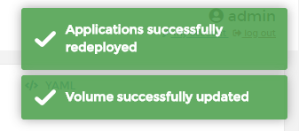

# Increase the volume

Using Portainer, you can increase the size of a volume. 

<b>Note</b>: Is only possible to increase the size of the volume. You cannot reduce the size of a volume.

## Increasing a volume

Go to <b>Volumes</b> and select the volume you want resize. 

In the tab <b>Volume</b> you will see the current size of your volume. Click <b>Increase size</b>. After that you will able to enter a new size for that volume.

Enter the new value and click <b>Update size</b>.

You will see a warning if the volume is used by any app at this this time and you will be asked to confirm if you want resize and redeploy the app. Click <b>Redeploy the applications</b> to confirm.

If eveything works as expected, you will see a pop up confirming the resize of your volume. 

## :material-note-text: Notes

[Contribute to these docs](https://github.com/portainer/portainer-docs/blob/master/contributing.md){target=_blank}