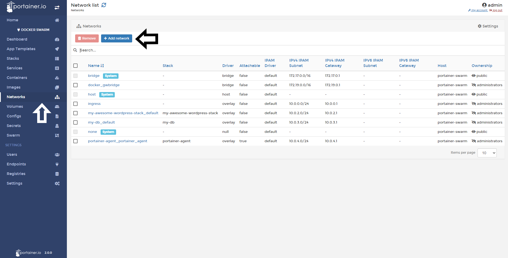
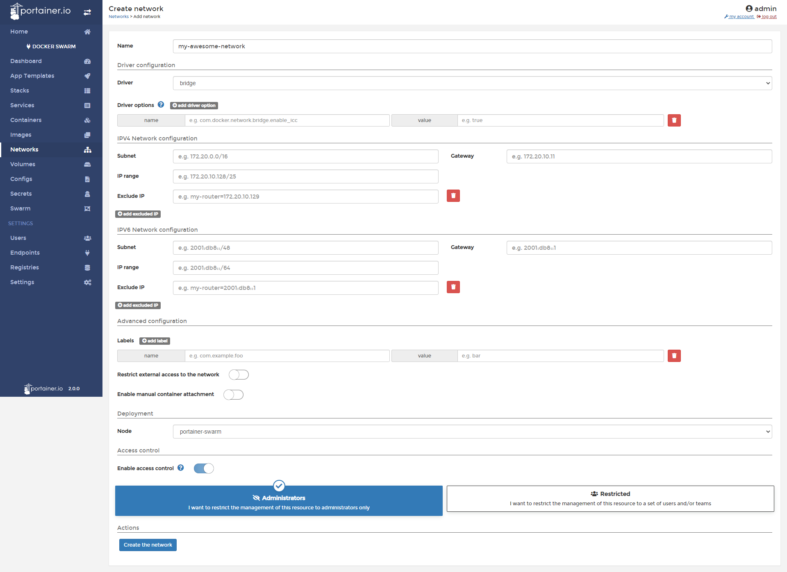

# Add a Network

Portainer allows you to manage networks for your containers environments. You will be able to to create these network types:

* Bridge: the default network driver. If you don’t specify a driver, this is the type of network you are creating. Bridge networks are usually used when your applications run in standalone containers that need to communicate.
* Macvlan: Macvlan networks allow you to assign a MAC address to a container, making it appear as a physical device on your network. The Docker daemon routes traffic to containers by their MAC addresses. Using the macvlan driver is sometimes the best choice when dealing with legacy applications that expect to be directly connected to the physical network, rather than routed through the Docker host’s network stack.
* Overlay: Overlay networks connect multiple Docker daemons together and enable swarm services to communicate with each other. You can also use overlay networks to facilitate communication between a swarm service and a standalone container, or between two standalone containers on different Docker daemons.
* IPvlan: IPvlan is similar to macvlan with the difference being that the endpoints have the same mac address. ipvlan supports L2 and L3 mode. In ipvlan l2 mode, each endpoint gets the same mac address but different ip address. In ipvlan l3 mode, packets are routed between endpoints, so this gives better scalability.

## Adding a Network

To add a network in Portainer, click <b>Networks</b> and then click <b>Add Network</b>.

In the next screen, you need to define the following information:

* Name: Name your network
* Driver: Define the type of network that you will use. (See above the description of each driver).
* IPv4 Network configuration: You can define IP ranges, Subnet, gateway and exclude IP. If this data is not filled, Docker will assign a range automatically.
* IPv6 Network configuration: You can define IP ranges, Subnet, gateway and exclude IP. If this data is not filled, Docker will assign a range automatically.
* Labels: Define labels for you network.
* Restrict External Access to the network: Allows you to isolate the containers inside of that network.
* Enable manual container attachment: Select the toggle if the users can attach this network to running containers.
* Deployment: Select the node where this network is going to be created.

When everything is set, click <b>Create the Network</b>.

## Notes

[Contribute to these docs](https://github.com/portainer/portainer-docs/blob/master/contributing.md).