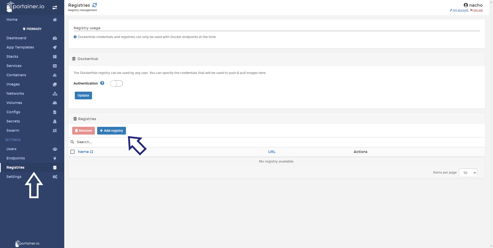
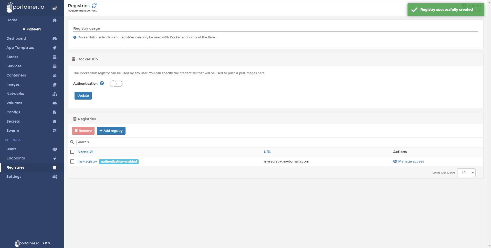

# Add / Connect a new registry

Portainer can connect to many of the well known registries including Quay.io, Azure Container Registry, Gitlab Container Registry, and a Custom Registry.

## Adding a new registry

Click <b>Registries</b> and then <b>Add Registry</b>.

Select the desired registry and then add your appropriate credentials details. Once complete click <b>Add Registry</b>.

## How to add a Custom Registry

Portainer can connect to custom or 3rd party registries. First select <b>Custom Registry</b> and enter the details there.

The required fields are <b>name</b> of the registry and <b>address</b>, if any authentication is required, you must enable the <b>authentication</b> toggle and add your login details.

Once all the details are entered, click <b>Add Registry</b>. If successful you will.

## :material-note-text: Notes

[Contribute to these docs](https://github.com/portainer/portainer-docs/blob/master/contributing.md){target=_blank}