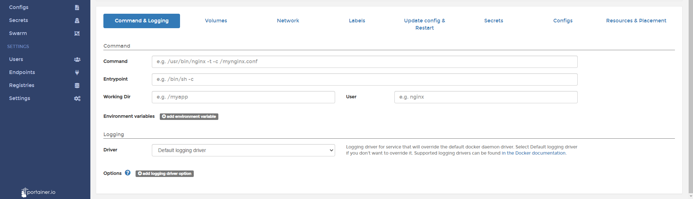

# Create a new service

In this help article, you will learn how to deploy a new service. This article applies to Docker Swarm environments.

The services are collections of containers. In this case, We're going to deploy an NGINX Web Server.

## Creating a new service

Once you logged into Portainer, click in Services and then <b>Add Service</b>.

Fill according to your needs. Choose a name for the service, the image you going to use, ask your self if need to be replicated in the same host, or deployed in Global mode (One container on each host).

Also, you need to define how the ports are exposing for that service.

At the bottom of the page, you will see more options to configure your service, if needed, set up according to. If not. Do a click in <b>Create The Service</b>.

If everything works as expected, you will see your service listed.

## Notes

Do you think that is missing something here? Contribute with this admin guide forking the repo [Portainer-Docs](https://github.com/portainer/portainer-docs) and propose changes.