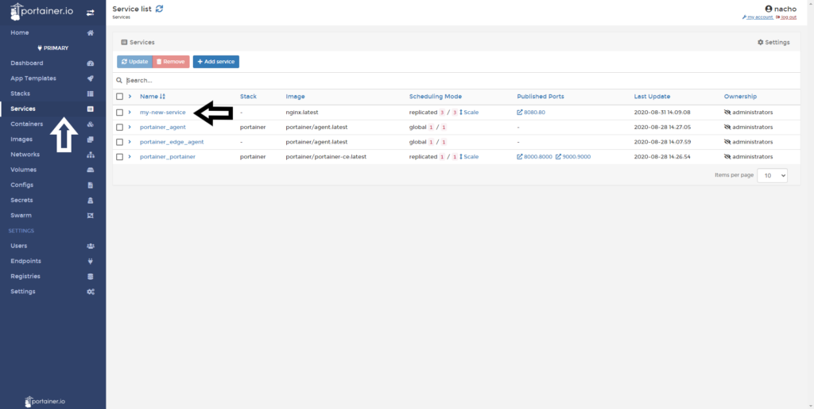

# How to view services logs

Service logs are incredibly useful for troubleshooting issues and service behaviour. 

## Accessing to Service Logs

Click <b>Services</b> and then choose the service you want to view the logs for.

Click <b>Service logs</b>.

Logs are then displayed with the ability to:

* Turn off Auto Refresh

* Wrap Lines

* Display Timestamps

* Search or filter logs

* Increase the number of lines to fetch

* Copy, Copy Selected or Unselect log lines

## :material-note-text: Notes

[Contribute to these docs](https://github.com/portainer/portainer-docs/blob/master/contributing.md){target=_blank}