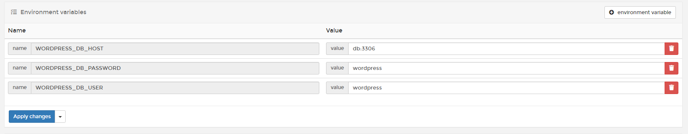
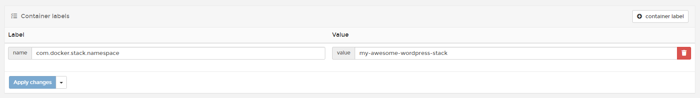
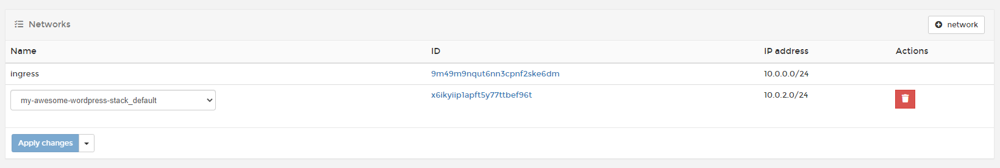
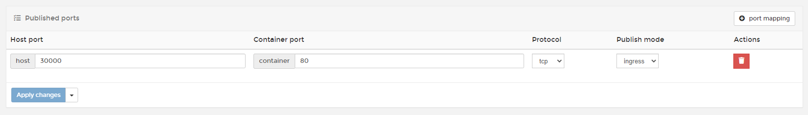
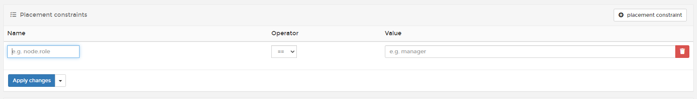
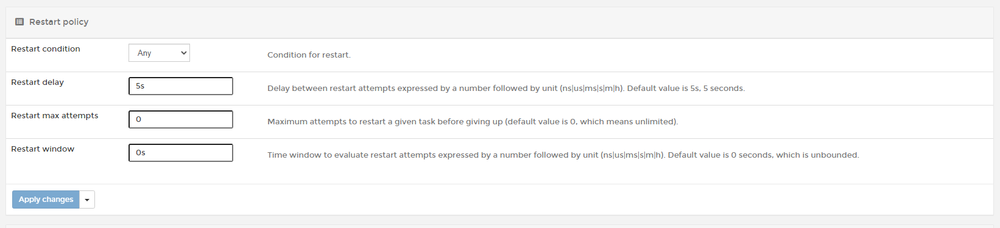

# Configure Service Options

Before of after you deploy a service, you can configure a wide range of options to your service. In this article, we going to review each option available that you can use from Portainer.

To make additions or changes of configuration, you need go to <b>Services</b> and choose the service you want configure.

## Container Specification

### Environment Variables

The environment variables are useful to set configuration at the same time that the container is created. If you need to add new environment variables after that service was deployed, you can do it. 

### Labels

Container labels can be used to leave notes of that container or specify configuration.

### Mounts

You can mount or bind volumes from Portainer. You can also set if that volume needs to set in <b>Read Only</b>. The only thing you need to do is select a created volume, specify the path in container and click <b>Apply Changes</b>.

## Networks & ports

### Networks

You can define one or more networks for your service; this can even been done after it has been deployed. You only need to <b>create your network</b> and then, select from the dropdown list. 

### Published Ports

Here, you can publish ports to access this container from outside the host. You can set new or modify the current ports.

### Host file entries

This is used when you need to manually specify a hostname or url; associat the URL to an internal or external IP Address.

## Service specification

### Resource limits and reservations

From Portainer, you can set limitations about the resource utilization, like Memory, CPU Reservation, CPU Limit, etc. 

### Placement constraints

Use placement constraints to control the nodes a service can be assigned to.

### Placement preferences

While placement constraints limit the nodes a service can run on, placement preferences try to place tasks on appropriate nodes in an algorithmic way (currently, this is only spread evenly).

### Restart Policy

Docker provides restart policies to control whether your containers start automatically when they exit, or when Docker restarts. Restart policies ensure that linked containers are started in the correct order.

The options are the following:

* Any: Restart under any condition (Restarted host or Docker daemon).
* On Failure: Restart the container if it exits due to an error, which manifests as a non-zero exit code.
* None: Do not automatically restart the container.

You can also adjust Restart Delay, Max Attempts and Restart Window. 

### Update Configuration

Updates a service as described by the specified parameters. The parameters are the same as docker service create. Refer to the description there for further information.

Normally, updating a service will only cause the service’s tasks to be replaced with new ones if a change to the service requires recreating the tasks for it to take effect.

### Logging Driver

Docker includes multiple logging mechanisms to help you get information from running containers and services. These mechanisms are called logging drivers.

Each Docker daemon has a default logging driver, which each container uses unless you configure it to use a different logging driver.

### Service Labels

Add metadata to containers using Docker labels. You can use either an array or a dictionary.

It’s recommended that you use reverse-DNS notation to prevent your labels from conflicting with those used by other software.

### Configs

Docker 17.06 introduces swarm service configs, which allow you to store non-sensitive information, such as configuration files, outside a service’s image or running containers. This allows you to keep your images as generic as possible, without the need to bind-mount configuration files into the containers or use environment variables.

### Secrets

In terms of Docker Swarm services, a secret is a blob of data, such as a password, SSH private key, SSL certificate, or another piece of data that should not be transmitted over a network or stored unencrypted in a Dockerfile or in your application’s source code.

## :material-note-text: Notes

[Contribute to these docs](https://github.com/portainer/portainer-docs/blob/master/contributing.md){target=_blank}