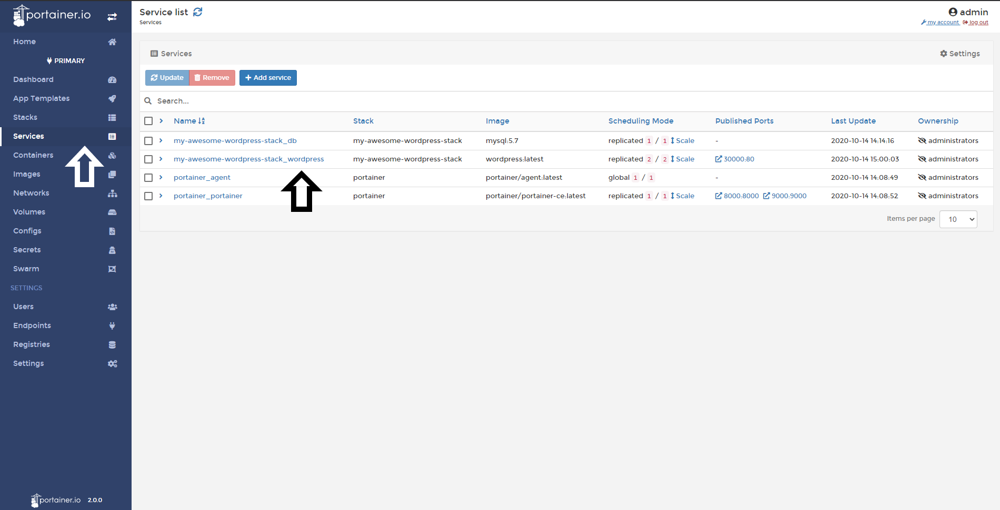
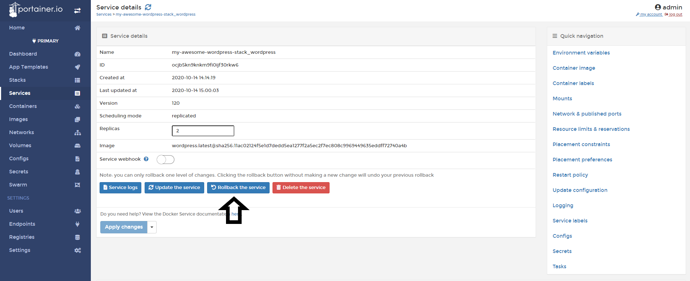

# Rollback a Service

After make a change to a service in Docker Swarm, you can rollback those changes if your applications are not working as expected.

## Rollbacking a Service

To rollback a service to the last state click <b>Services</b>, choose the <b>service</b> you want to rollback.

Then click <b>Rollback the service</b>.

You will be asked to confirm this rollback.

If successful, a green pop up confirming will show at the top right of screen.

