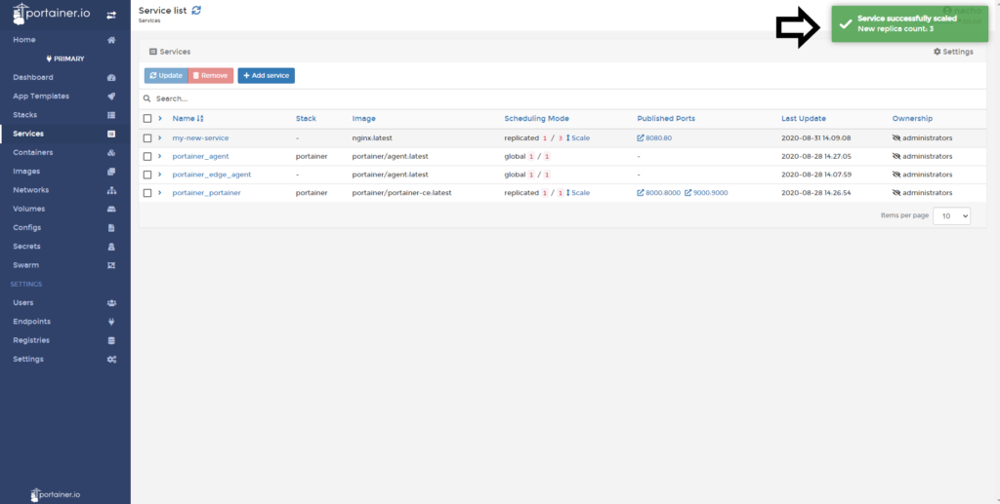
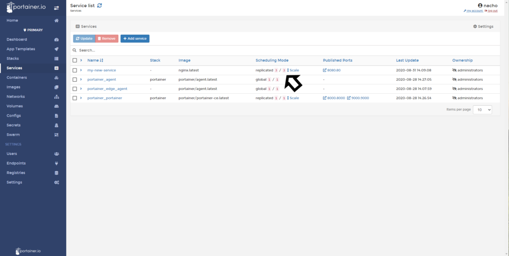

# Scale a service

In this help article, you will learn how to scale your services. This is a powerful feature because, in no time, Portainer allows you to scale your services horizontally.

## Scaling Applications

Once you logged in Portainer, do a click in <b>Services</b> and then do a click in <b>scale</b>.

Enter the number of replicas you want for this service and click on the <b>check</b>.

If everything works as expected, you will see the following pop up.

After a few seconds (depends on the size of the container), you can refresh this page, and you will see (as this case) three replicas running.

## Notes

[Contribute to these docs](https://github.com/portainer/portainer-docs/blob/master/contributing.md).