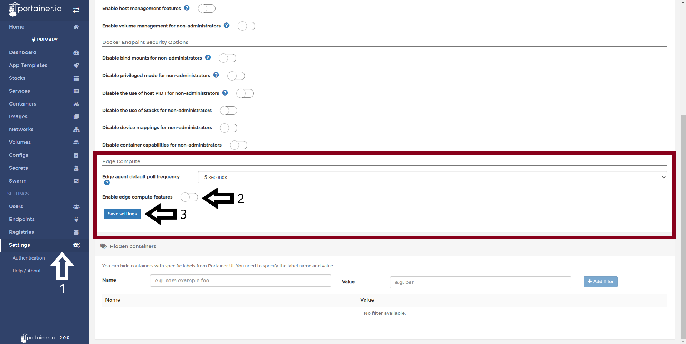

# Enable Edge Computing features

In today’s world you can easily have hundreds - if not thousands - of Docker-enabled devices in your environment. Most of these systems run without any form of clustering or run a lean orchestrator such as Docker Swarm or Kubernetes.

Remote devices may be distributed across multiple sites and/or across many different networks, some may even be attached to the internet using mobile data or satellite. To be managed effectively, engineers need a way to control distributed instances centrally, which is exactly what Portainer does with Edge Computer Features.

## Enabling Edge Compute Features

First you must enable Edge Compute in the Portainer Settings.

1. Click <b>Settings</b> and scroll down to <b>Edge Compute</b> section.
 
2. Enable the toggle and 3. click <b>Save Settings</b>

After that, you will see that a few options appear in the side menu. 

## More Resources

Take a look to the Edge section in the User Guide to see how to use it. 

* [Deploy an Stack](/v2.0/edge/stacks/)
* [Add a Job](/v2.0/edge/jobs/add/)
* [Managind Edge Groups](/v2.0/edge/groups/)

# Notes

[Contribute to these docs](https://github.com/portainer/portainer-docs/blob/master/contributing.md).