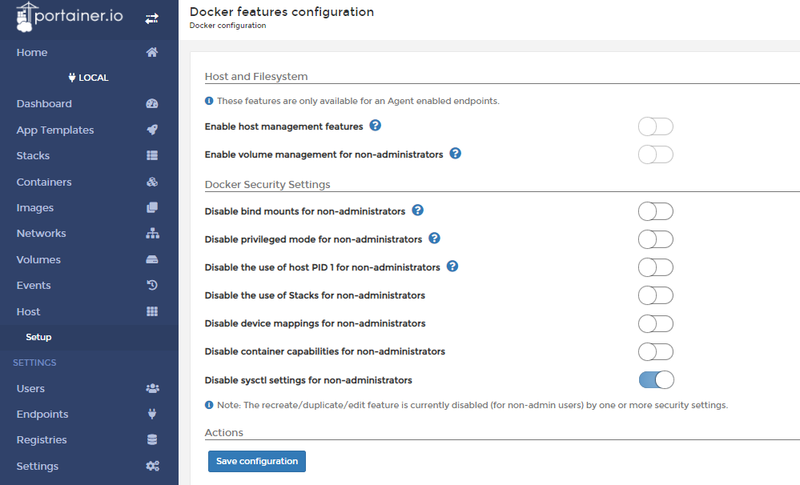

# Security Options

Portainer allows various configuration options to add secuirty to your environment. In this help article, we going to review the security options that you can find under <b>Host/Cluster</b> --> <b>Setup</b>.

## Docker Endpoint Security Options

* <b>Disable bind mounts for non-administrators</b>: This security setting blocks the ability for non-admin users within Portainer to use bind mounts when creating containers and/or services/stacks. When this is enabled, the option to attach to a host file system path is removed.

* <b>Disable privileged mode for non-administrators</b>: This security setting blocks the ability for non-admin users within Portainer to elevate the privilege of a container to bypass SELinux/AppArmour. When this is enabled, the option to select "Privileged" mode when creating a container is removed. 

* <b>Disable the use of host PID 1 for non-administrators</b>: This blocks the ability for non-admin users within Portainer to request that a deployed container operates AS the host PID. This is a security risk if used by a non-trustworthy authorized user as when they operate as PID1, they are in effect able to run any command in the container console as root on the host.

* <b>Disable the use of Stacks for non-administrators</b>: This is a "sledgehammer" method to remove any possibility for non-admin users within Portainer to find and use weaknesses in the Docker architecture. Whilst Portainer have provided the ability to disable some of the more common exploits, we cannot possibly block them all as there are any number of capabilities that could be added to a container to attempt to gain access to the host. This feature simply allows an admin to disable all possible entry-points.

* <b>Disable device mappings for non-administrators</b>: This blocks the ability for users to map host devices into containers. Whilst the ability to map devices is generally used for good (eg mapping a GPU into a container), it can equally be used by non-trustworthy authorized users to map a physical storage device into a container. It is possible to mount /dev/sda1 into a container, and then from a console of that container, the user would have complete access to the sda1 device without restriction.  By enabling this feature, Portainer blocks the ability for non-admins to map ANY devices into containers.

* <b>Disable container capabilities for non-administrators</b>: Enabling the setting will hide the container capabilities tab for non-administrators when they are creating a container.

* <b>Disable sysctl settings for non-administrators</b>: Enabling this setting will remove ability for non-admin users to use sysctl options. Non-admin users will not be able to recreate/duplicate/edit any containers when this setting is toggled on.

## :material-note-text: Notes

[Contribute to these docs](https://github.com/portainer/portainer-docs/blob/master/contributing.md){target=_blank}