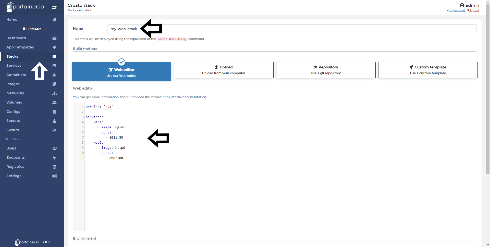
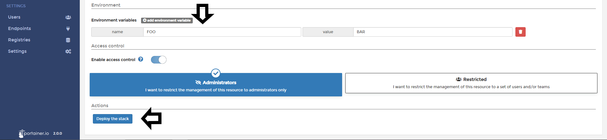
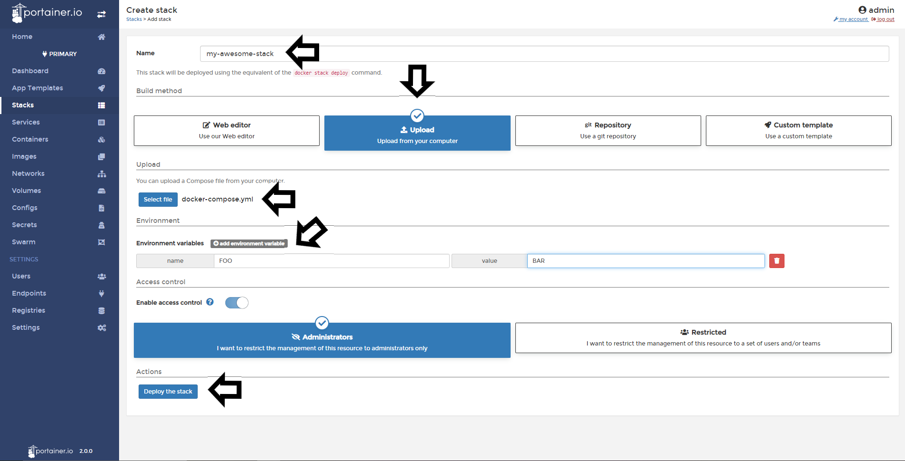
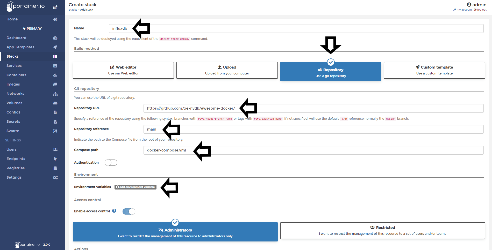

# How to create a new Stack

Stacks are collections of services running in a Docker Swarm environment.

## Deploying a new stack

You can deploy a new stack from Portainer using the following options:

* Web editor: Using our Web Editor, you will capable to define the services for this stack using a docker-compose format. 
* Upload: If you're already have a stack.yml file, you can upload from your computer to deploy that stack.
* Git Repository: You can use a docker-compose format file hosted in Github.
* Custom Template: If you already created a template of stacks, you can deploy from this option. 

### Web Editor

To use our web editor, you need to Select <b>Stacks</b>, <b>name</b> the stack, select <b>Web Editor</b> and you can start to define your services using the editor. 

You can also define <b>Environment Variables</b> if needed. 

When you set up everything, click <b>Deploy the Stack</b>.

### Uploading a stack file

In Portainer, you can create Stacks from compose YML files. To achieve this. Click <b>Stacks</b>, then <b>Add Stack</b>.

Now <b>Name</b> your new stack, select <b>Upload</b> and choose your compose file from your computer, <b>add environment variables</b> if needed and then click <b>Deploy the Stack</b>.

### Deploy from Github Repository

If you have your compose file hosted in Github, you can deploy from there. Select <b>Stacks</b>, then <b>Add Stack</b>, select <b>Git Repository</b>. 

<b>Name</b> your stack, and then, you need to define information about your <b>Github repository</b>:

* <b>Repository URL:</b> Here, you need to set the URL of your Github Repository.
* <b>Repository Reference:</b> Here, you need to define your branch.
* <b>Compose Path:</b> Here, you need to define the path to your compose file from the root of the repository.

If you need authenticate, define your user and password. <b>NOTE</b>: If you have a 2FA configured in Github, your passcode is your password. 

Set environment variables if needed and then click <b>Deploy the Stack</b>.

The docker-compose.yml file is only pulled once from GitHub for the creation of you stack. After creation, you cannot (auto-)update the stack based on changes in or commits to the file on GitHub. You can make local changes in the <b>Editor</b> tab like for stacks deployed from the <b>Web editor</b> but this won't affect the GitHub hosted file. See for the current status of a feaure request [Add the ability to update and redeploy a stack created from a git repository #1753](https://github.com/portainer/portainer/issues/1753)

## Notes

[Contribute to these docs](https://github.com/portainer/portainer-docs/blob/master/contributing.md).
