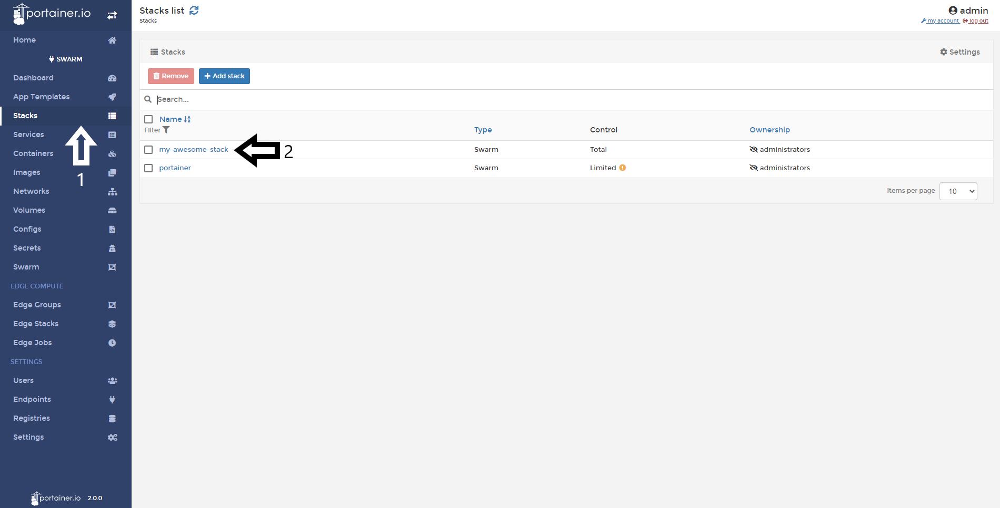
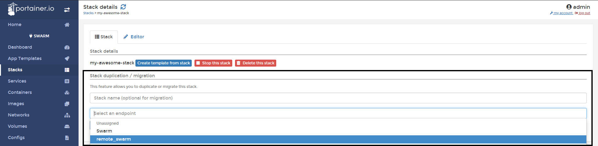
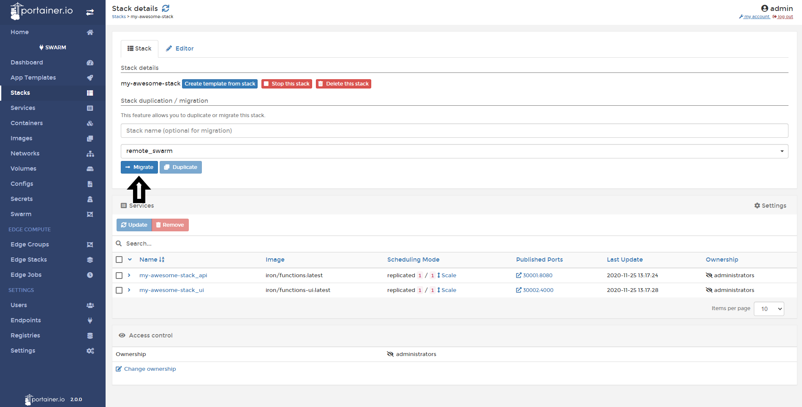

# Migrate a Stack to another Swarm Cluster

From Portainer, you can migrate your stacks from one cluster to another. In this help article, you will learn how to do it. 

## Migrating a Stack to another Swarm Cluster

In this case, we have a local Swarm Cluster and we want to move 'my-awesome-stack' to another cluster. To do this, go to <b>Stacks</b>, and select your Stack.

From the <b>Duplicate/Migrate</b> section, select the endpoint where you want to migrate.

Once you selected the endpoint, click <b>Migrate</b>.

You will see a pop-up advising about the migration. If you're sure, click <b>Migrate</b>.

Once the migration is complete, you will see a pop-up confirming the migration.

## Notes

[Contribute to these docs](https://github.com/portainer/portainer-docs/blob/master/contributing.md).