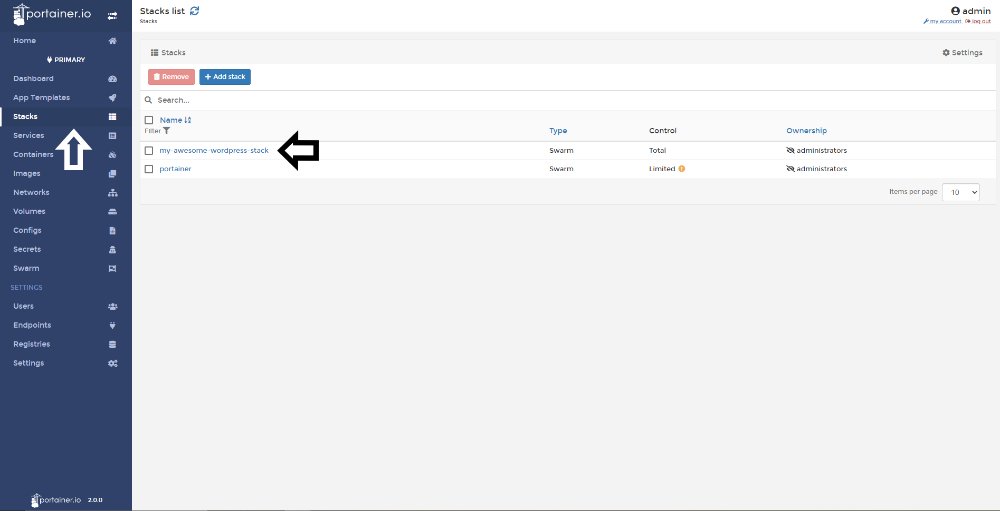
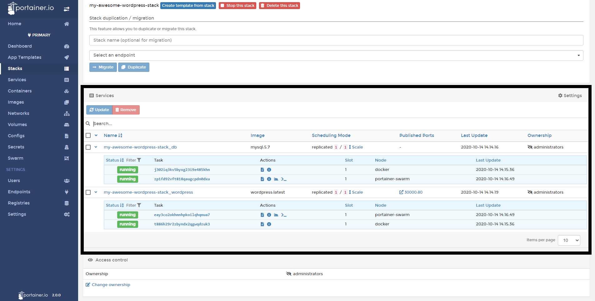

# Inspect a Stack

In Portainer, you can inspect your stacks to see what is running or access to their logs and stats. 

## Inspecting a Stack

To inspect the task associated to your stack, select <b>Stacks</b> and then select the stack you want to inspect.

Here you can:
* View what services that make up this stack 
* If they are running or stopped
* How many replicas running in each host
* Access to logs
* Inspect the task stats
* Access to the container console

## Notes

[Contribute to these docs](https://github.com/portainer/portainer-docs/blob/master/contributing.md).