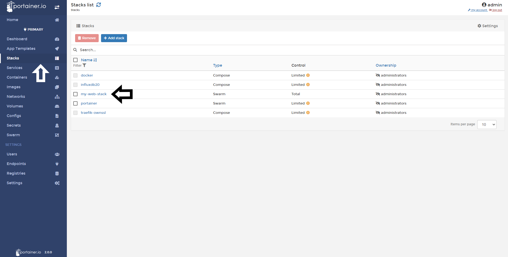
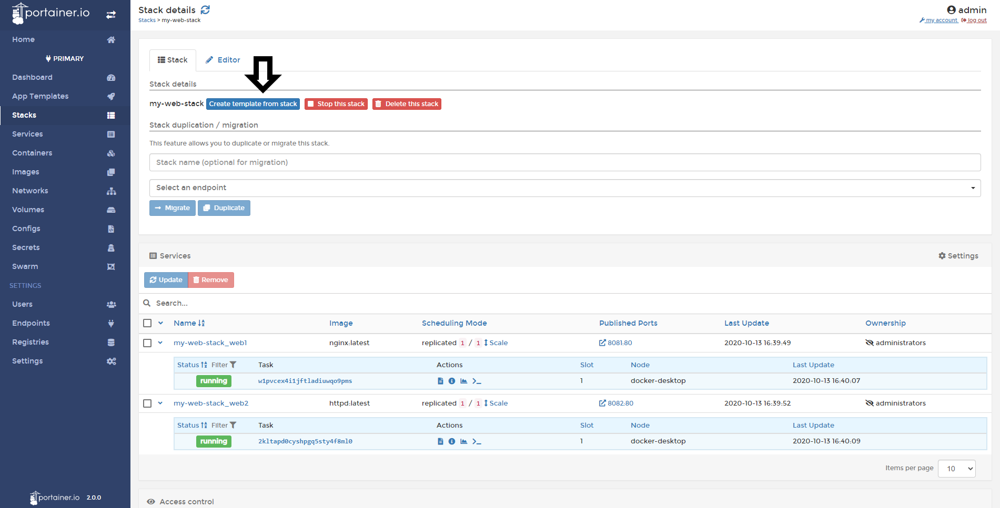
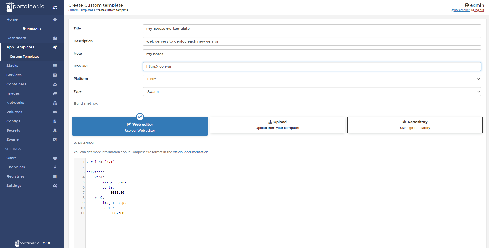
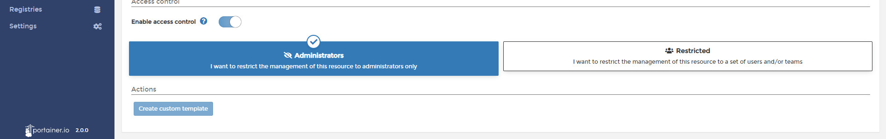

# Create a template from deployed Stack

In Portainer, you can create an App template from deployed Stacks. This is really useful when you need to deploy the same stack several times. 

## How to creating a Template from a Stack

Do a click in <b>Stacks</b> and pick you already deployed stack.

Then, click in <b>Create Template from stack</b>.

Now, you need to define some properties for this new template. 

* Title: Name your new template.
* Description: Short description about your template.
* Notes: You can write notes about this template.
* Icon URL: You can set up a icon from a URL
* Platform: Here, you need to define if your template is ready for use in Linux or Windows environments. 
* Type: Choose between Swarm and Docker Standalone.

Also, you can upload from your computer another compose file or get the file from a Github repository if needed. 

After define this, you can add more services to your template.

When everything is set, scroll down and create this custom template.

## Notes

[Contribute to these docs](https://github.com/portainer/portainer-docs/blob/master/contributing.md).