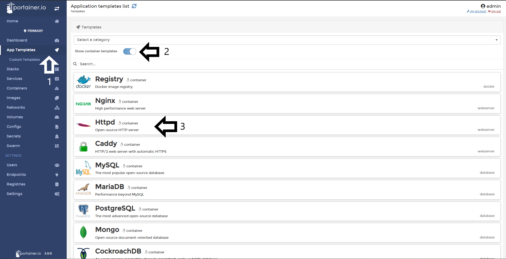
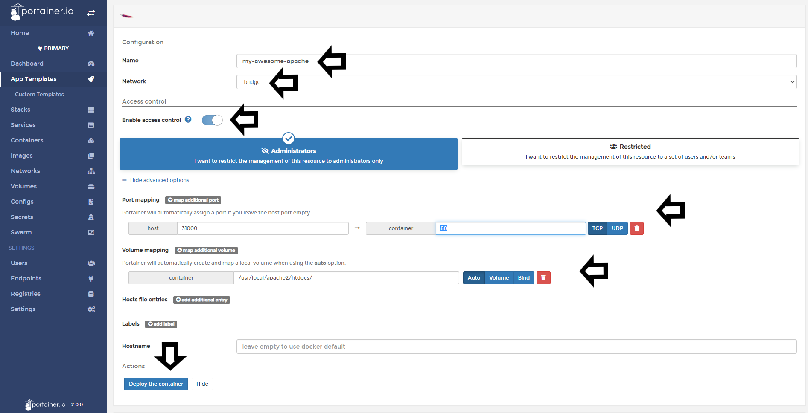

# Deploy an standalone app (Container)

From Portainer, you will able to deploy an standalone app from the default template list. In this help article, you will learn how to do it. 

## Deploying an standalone app

To deploy a standalone container from the templates, you need to go to <b>App Templates</b>, enable the toogle <b>Show container templates</b> and pick the app you want to deploy. For this example, I will deploy an Apache Web Server.

After that, define a name, network, access control if needed, port mapping, volumes and when all is set, do a click in <b>Deploy the Container</b>.

Meanwhile the container is deployed, you will see an animation in the button.

If everything work as expected, you will see a pop up confirming that the container was deployed.

## Notes

[Contribute to these docs](https://github.com/portainer/portainer-docs/blob/master/contributing.md).