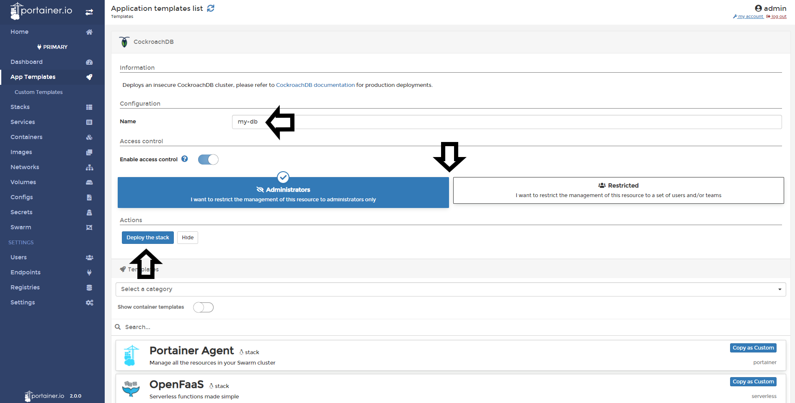
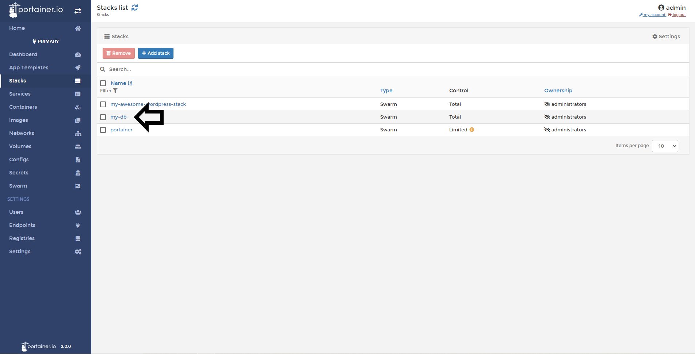
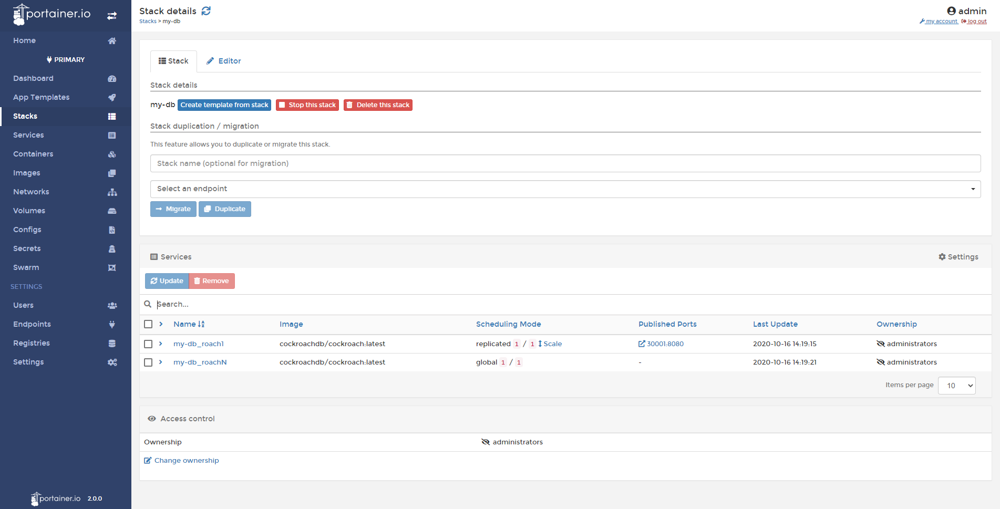

# How to deploy a stack from a template

Portainer allows you to deploy an entire stack from a template from the template list which includes default and custom templates. Also see [creating a template from a Stack](/v2.0/stacks/template).

## Deploying an Stack

To deploy a stack, go to <b>App Templates</b> and choose the template you want to deploy. In this example, I will deploy a CockroachDB cluster.

Set a <b>name</b>, define access control (if enabled with the toogle) and click <b>Deploy the Stack</b>

You will see an animation in the button while the stack is deploying:

If everything work as expected, you will see your new stack deployed. 

Click the name of your stack to see the details of the deployment:

## Notes

[Contribute to these docs](https://github.com/portainer/portainer-docs/blob/master/contributing.md).
